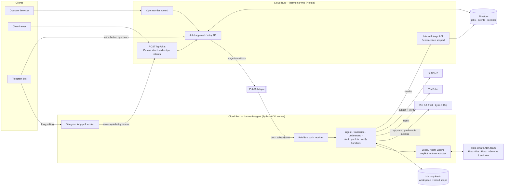

# Harmonia

**Harmonia is an asynchronous social media content agent for startups.** Give it a YouTube video — a founder interview, a product walkthrough, a podcast appearance — and it runs a full content-engine workflow: ingest, transcribe with Gemini, understand what is clip-worthy (moments, trend angles, meme angles), draft platform-native posts, then **stop and wait for explicit human approval** before anything leaves the building. Approved actions execute through official platform APIs with idempotent audit receipts, and published state is independently re-verified afterwards.

Operators drive Harmonia from three equivalent surfaces: the web dashboard, a conversational chat drawer (`/api/chat`), and a Telegram bot. Every surface shares one intent grammar and one approval gate; no side-effecting action happens without an approval receipt.

## The pipeline

Harmonia runs as an asynchronous, event-driven workflow on Pub/Sub. A single job travels across two services with durable state in Firestore at every step:

```
ingest → transcribe → understand → draft → awaiting_approval → publish → verify
```

- **Ingest**: YouTube metadata via oEmbed / YouTube Data API; audio pulled with yt-dlp.
- **Transcribe**: Gemini 3.5 Flash transcribes the audio into timed segments.
- **Understand**: Sophia uses Gemini multimodal video plus the transcript to identify clip-worthy spoken and visual moments, trend angles, and meme angles.
- **Draft**: Nimi drafts with Gemma 3 on a configured Vertex endpoint, Dara reviews with Gemini, and Temi plans publish proposals with Flash-Lite; deterministic contracts validate every handoff.
- **Awaiting approval**: publishing is proposed as discrete actions. The model cannot self-authorize.
- **Publish**: approved actions execute idempotently (stable idempotency keys from `jobId + actionId + contentHash`); X posts go through the official X API v2, while separately approved Veo/Lyria actions create internal media assets.
- **Verify**: published state is confirmed by fresh independent API reads — never because a model said so.

## Architecture



### Separation of concerns

| Concern | Where | Interface |
|---|---|---|
| Ingestion | `agent/harmonia_agent/youtube.py` | metadata fetch + bounded audio download |
| Transcription / understanding / drafting | `agent/harmonia_agent/content.py`, `agents.py`, `gemma_model.py` | Gemini transcription, multimodal Sophia, Gemma Nimi, Gemini review/planning |
| Intent parsing (chat + Telegram) | web `src/lib/chatIntent.ts` | Gemini structured output: `{intent, youtubeUrl?, jobId?}` |
| Approval gate | web `src/lib/policy.ts`, `src/lib/decisions.ts` | deterministic risk rules; single decision writer shared by REST, chat, and Telegram |
| Publishing | `agent/harmonia_agent/x_client.py` | official X API v2, idempotent |
| Verification | `agent/harmonia_agent/stages.py` | fresh GET of the published artifact |
| Operator surfaces | dashboard UI, `/api/chat`, `telegram_bot.py` | identical grammar; mutating actions require operator token |

## Technology

- **Heterogeneous Google models**: Gemini 3.5 Flash-Lite for routing/planning, Gemini 3.5 Flash for strategy/multimodal analysis/editing/transcription, and Gemma 3 12B IT on a Vertex endpoint for copywriting.
- **Google generative media**: Veo 3.1 Fast for 4-second vertical b-roll and Lyria 3 Clip for 30-second music, both individually priced and always approval-gated.
- **Google ADK** (Python) for the worker service and agent scaffolding.
- **Vertex AI Agent Engine + Memory Bank** as explicit managed cognition and exact-scope cross-session context options; Firestore/Pub/Sub remain the durable workflow engine.
- **Cloud Run** hosts both services (web: Next.js standalone build; agent: Python container).
- **Firestore** persists job state, stage events, approvals, receipts, verifications, and packets.
- **Pub/Sub** drives every stage transition; transient failures nack for redelivery, permanent failures stay visible.
- **OpenTelemetry** exports metadata-only, W3C-correlated stage/agent/model/memory/media audit spans; the product does not collect private chain-of-thought.

## Local spin-up

Prerequisites: Node 20+, Python 3.12+, [`gcloud` CLI](https://cloud.google.com/sdk/docs/install). Emulators make local development free and hermetic.

```bash
git clone https://github.com/danielAsaboro/harmonia.git
cd harmonia
npm install
cp .env.example .env.local   # at minimum: GEMINI_API_KEY (+ INTERNAL_API_TOKEN)
./scripts/dev.sh             # Firestore + Pub/Sub emulators, web :3000, ADK worker
```

Open http://localhost:3000, paste a YouTube URL, and watch the job move through the stages. Approve or reject the proposed actions in the dashboard when the job reaches the approval gate.

> Full documentation lives in [`docs/`](./docs) — a Mintlify site covering the [architecture](./docs/architecture.mdx), [pipeline](./docs/pipeline.mdx), the [proactive agent](./docs/proactive-agent.mdx), offline mock modes, configuration, and deployment.

### Operator chat

Click the chat bubble on the dashboard (or `POST /api/chat` with `{message}`):

```
"create a job from https://youtu.be/<id>"
"status of job <id>"          # or just "status"
"show drafts for <id>"
"approve job <id>"            # mutating: requires x-operator-token when configured
```

Mutating chat intents are gated exactly like the REST routes. Set `GEMINI_API_KEY` in the web environment to enable intent parsing.

### Telegram bot

Set `TELEGRAM_BOT_TOKEN` and `TELEGRAM_ALLOWED_CHAT_ID` (both required together) and restart the worker — the bot starts automatically inside the FastAPI process (or run `python -m harmonia_agent.telegram_bot`). The bot only responds inside the allow-listed chat. Messages go through the same `/api/chat` grammar; **approvals require tapping an inline button**, which triggers the same decision endpoint the dashboard uses. Bot tokens are never echoed into chats.

Run tests:

```bash
npm test                     # TypeScript: policy gate, idempotency, state machine, packet assembly
npm run test:agent           # Python: ingest parsing, telegram callbacks, failure classification
```

## Deploy to Google Cloud

One-time bootstrap, then repeatable deploys:

```bash
gcloud auth login
export PROJECT_ID=your-project-id
export REGION=us-central1
export GEMINI_API_KEY=...            # required
export OPERATOR_TOKEN=...            # recommended: gates all mutations
export X_BEARER_TOKEN=...            # optional: enables real X publishing + verification
export YOUTUBE_API_KEY=...           # optional: richer ingest metadata
export TELEGRAM_BOT_TOKEN=...        # optional: Telegram operator surface
export TELEGRAM_ALLOWED_CHAT_ID=...

./infra/setup.sh             # enables APIs, Firestore, topics, SAs, IAM, secrets
./infra/deploy.sh            # builds both services via Cloud Build, deploys to Cloud Run,
                             # wires the Pub/Sub push subscription
```

Optional integrations are mounted only if their secrets exist, so missing tokens never block deployment — the corresponding capability stays visibly disabled rather than fake-succeeding.

Both services scale to zero. The web service is public-read; all mutations require the operator token. The agent accepts only Pub/Sub push invocations authenticated via OIDC + Cloud Run IAM. Secrets live in Secret Manager; nothing sensitive lives in the repo or client bundle.

## Security and reliability model

- **Minimum permissions**: two dedicated service accounts; web gets datastore + pubsub publisher, agent gets datastore + secretAccessor. Platform tokens are scoped to what they publish.
- **Human approval gate**: publishing requires an explicit approval per action. Chat can propose; only token-holding operators decide. On Telegram, decisions require an inline-button tap scoped to the allow-listed chat.
- **Idempotency**: every action carries a stable key derived from `(jobId, actionId, contentHash)`; duplicate deliveries produce `already_applied` receipts instead of duplicate posts.
- **Audit receipts**: each execution records outcome (`applied` / `already_applied` / `failed`), artifact URL, and platform response in Firestore.
- **Resumable state**: jobs survive worker crashes; Pub/Sub redelivery plus server-side stage guards (`assertTransition`) prevent duplicated side effects. Failed jobs retry from their failure point.
- **Managed cognition without split-brain state**: Agent Engine sessions are invocation-scoped and discarded; Memory Bank stores only eligible durable facts under exact workspace/brand scope.
- **Failure honesty**: permanent failures are preserved as visible unresolved gaps; errors never become simulated success.

## Project structure

```
harmonia/
├── src/
│   ├── app/api/                  # REST + internal APIs + POST /api/chat (NL ops surface)
│   ├── components/               # dashboard, job console, chat drawer
│   └── lib/                      # types, config, Firestore/Pub/Sub adapters,
│                                 # policy engine, decision writer, intent parser
├── agent/
│   ├── harmonia_agent/          # FastAPI worker, ADK agents, YouTube/X/Gemini,
│   │                             # Telegram long-poll bot
│   └── tests/                    # pytest units
├── infra/                        # setup.sh (one-time) and deploy.sh (revisions)
├── scripts/dev.sh                # emulator-based local loop
└── tests/                        # vitest units
```

## Status

Built for the [All Things Agentic Hackathon](https://allthingsagentichackathon.devpost.com/) — **The Taskmaster** category. Known limitations are tracked honestly in the dashboard itself: anything Harmonia cannot mechanically verify shows up as an unresolved gap rather than a green checkmark.
