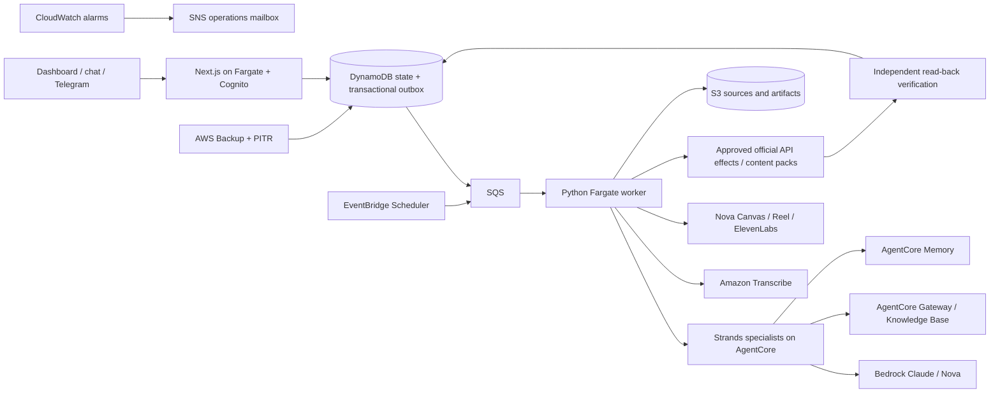
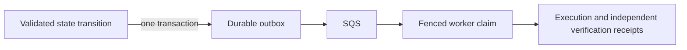

# Harmonia — Strands and AWS edition

Harmonia is a governed content operation for startups. Give it authorized source material and an outcome: its specialists analyze the evidence, propose a strategy, plan and draft content, request approval, execute approved effects, and independently verify the result.

This edition replaces the original Google backend with Strands Agents SDK and AWS while preserving the dashboard, conversational interface, specialist roles, official integrations, and human approval boundaries. It is being prepared for the Agents for Humans Professional Agents track.

**Edition boundary:** this repository's canonical production origin is [`app.useharmonia.xyz`](https://app.useharmonia.xyz), with dedicated Strands/AWS documentation at [`docs.app.useharmonia.xyz`](https://docs.app.useharmonia.xyz). The apex [`useharmonia.xyz`](https://useharmonia.xyz) and [`docs.useharmonia.xyz`](https://docs.useharmonia.xyz) remain the original All Things Agentic submission and must not be repointed to this edition.

**Evidence status:** the AWS edition is under local verification. No AWS deployment or paid provider rehearsal has been performed. The earlier Google edition's receipts do not prove this implementation. Paid calls are disabled by default.

## Architecture



Harmonia routes intent; Nimi analyzes; Ryan strategizes; Temi plans; Noni writes; Dara reviews; Maya presents; Nova explains status. The host owns tenant identity, prerequisites, budgets, approval, idempotency, and verification. A model cannot grant itself authority.

## Local checks without spending

Requirements: Node 22+, Python 3.12+, and npm. Docker is required to build deployment images. No provider credentials are needed for isolated unit tests.

```bash
npm ci
python3 -m venv agent/.venv
agent/.venv/bin/pip install -r agent/requirements.lock
npm test
npm run test:agent
npm run lint
npm run build
npm run infra:synth
npm run cost:topology
```

Database integration tests use official DynamoDB Local, not a production simulation. Set `AWS_LOCAL_ENDPOINT` to its loopback URL, `DYNAMODB_TABLE` to a fresh pk/sk table, and local-only AWS test credentials before running the integration suite.

For an interactive server, copy `.env.example` to `.env.local`, configure Cognito and the AWS services, and run `npm run dev`. There is no fake-login or fake-provider route. A complete content run requires explicit authorization of paid provider validation.

## Deployment

The CDK application in `infra/aws/` provisions an isolated VPC, autoscaled Fargate services, encrypted DynamoDB/S3/SQS/Secrets Manager resources, Cognito, AgentCore, research resources, scheduled wakes, WAF controls, encrypted logs and alarms, and AWS Backup. `infra/setup.sh` and `infra/deploy.sh` refuse to run until `HARMONIA_ALLOW_PAID_DEPLOYMENT=true` is set after budget authorization.

The deployment requires the reviewed `https://app.useharmonia.xyz` origin and matching regional ACM certificate, Google federation credentials with the `https://app.useharmonia.xyz/api/auth/callback` redirect, a confirmed operations mailbox, and an ECR ARM64 cognition image pinned by digest. Build that image from `agent/Dockerfile.agentcore`; web, Fargate worker, and scanner images are CDK assets. Before an authorized staging run, follow the [release procedure](docs/operations/release.mdx), including all four local image scans. See [deployment documentation](docs/deployment.mdx) for parameter names, backup/restore, secret rotation, and incident runbooks.

`HARMONIA_ALLOW_PAID_AWS=false` prevents cognitive and generative provider work. Configured prices, integration credentials, capability enablement, and live verification are separate prerequisites. Never reuse old approval records to enable new effects.

## Product coverage and boundaries

- Authorized uploads, pasted text, documents, web sources, YouTube, and connected brand libraries.
- Strategy approval, editorial planning, typed content, review, clips, images, music, and content packs.
- Official X and LinkedIn publishing, scoped Google Drive/Calendar connections, and allow-listed Telegram.
- Memory, research, Heartbeat, Micro-reflections, Dream, Wakeup, bounded experiments, and rollback.
- Immutable receipts, digest verification, tenant isolation, and reconciliation of uncertain effects.

Integration presence does not imply authenticated production proof. A rejected publication is not a published post; an exported pack is an exported pack.

The Content operation workspace shows durable strategy, campaigns, planned items, and proposed changes. After a strategy promotion, review the queued-work proposal to approve new item revisions under the current strategy or cancel the queued work. Running and completed items retain their existing authority. Source replacement has its own exact review: acceptance pins a new source selection and starts the normal retrieval and analysis stages; rejection retains eligible existing work. Stale acceptance returns a conflict requiring a current review.

Chat and Telegram can append a deliverable to an existing campaign or plan when the request identifies the target, current plan revision, output, channel, and scheduled timestamp with timezone. The host resolves those references and enforces capacity, dependency, revision, and replay checks. Clarification answers remain separate from the original brief and carry their turn provenance into media requests and approvals.

## Provenance

This repository derives from the team's Harmonia implementation, including its UI, deterministic workflow, content contracts, and tests. This branch replaces its agent and cloud infrastructure and extends media production. The original history is retained. Submission materials must disclose incorporated pre-existing work and distinguish this edition's new work and evidence.

## Workflow authority

The pipeline uses collect · extract · understand · strategy · strategy approval · plan · draft · publish · verify handlers. Effect approval precedes execution. Strands supplies bounded judgment; deterministic host code selects stages, enforces policy, and owns state transitions. Memory remains advisory.



Duplicate suppression returns `already_applied` with the original receipt identity; it does not invent a new execution receipt. Unknown external outcomes require reconciliation. Only explicit operator replay persists a replay observation.

Unknown observation reads retain their reservation until an administrator records an evidence-bound resolution through the [learning reconciliation API](docs/learning-reconciliation.md).

The console uses Vercel AI SDK 7 (`ai` 7.0.97 and `@ai-sdk/react` 4.0.100). Maya proposes reference-only layouts; the server hydrates them from authoritative records into validated `data-harmonia-surface` UI message parts. Durable DynamoDB event sequences support replay and reconnect, while approval controls remain server-owned. Telegram routes ordinary allow-listed messages through the canonical chat router and the same decision service. This AWS edition is not live-evidenced yet.

## License

Harmonia application code is available under the [MIT License](LICENSE). Third-party dependencies and external media retain their own licenses and permissions.
