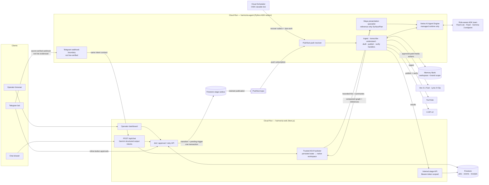

# Harmonia

**Harmonia is an asynchronous social media content agent for startups.** Give it an authorized YouTube video or upload and it creates a durable content job: ingest, transcribe, understand clip-worthy moments, draft platform-native posts, authorize exact effects, execute through idempotent commands, and record verification evidence. Consequential effects require either an exact human approval or an operator-created durable mandate whose evaluated payload is bound into the command.

The dashboard and authenticated web chat are active operator surfaces. Telegram has a verified webhook/nonce approval boundary in code, but live message ingestion and webhook configuration are not yet production-verified; do not present Telegram as an equivalent working surface until that evidence exists.

> **Deployment evidence status (2026-08-26):** the currently reachable Cloud Run URL is a `preview`-mode web-only revision. Read-only project inspection found no deployed agent service, Pub/Sub subscription, or Cloud Scheduler job. It is useful for UI review, but it is not evidence that the asynchronous pipeline or authenticated Gemini/ADK vertical slice is live. The topology below describes the implemented repository and target full deployment.

## Why Harmonia is an agent—and where it deliberately is not

Harmonia is agentic where the problem is ambiguous: Gemini/ADK specialists interpret multimodal source material, identify grounded moments and angles, create platform-native drafts, revise them, and propose bounded actions. It is deliberately deterministic where mistakes have consequences: Firestore/Pub/Sub progression, schema validation, cost reservation, policy, approval, idempotent execution, receipts, and independent verification. Humans retain final publishing authority. This is bounded agency inside a durable workflow, not an unrestricted model loop; the full stage/authority and KPI contract is in [`docs/operational-model.mdx`](./docs/operational-model.mdx).

## The pipeline

Harmonia runs as an asynchronous, event-driven workflow on Pub/Sub. A single job travels across two services with durable state in Firestore at every step:

```
ingest → transcribe → understand → draft → awaiting_approval → publish → verify
```

- **Ingest**: YouTube metadata via oEmbed / YouTube Data API; audio pulled with yt-dlp.
- **Transcribe**: Gemini 3.5 Flash transcribes the audio into timed segments.
- **Understand**: Sophia uses Gemini multimodal video plus the transcript to identify clip-worthy spoken and visual moments, trend angles, and meme angles.
- **Draft**: Nimi drafts with Gemma 3 on a configured Vertex endpoint, Dara reviews with Gemini, and Temi plans publish proposals with Flash-Lite; deterministic contracts validate every handoff.
- **Awaiting approval**: publishing is proposed as discrete actions. The model cannot self-authorize.
- **Publish**: approved actions execute idempotently (stable idempotency keys from `jobId + actionId + contentHash`); X posts go through the official X API v2, while separately approved Veo/Lyria actions create internal media assets.
- **Verify**: published state is confirmed by fresh independent API reads — never because a model said so.

## Architecture



### Separation of concerns

| Concern | Where | Interface |
|---|---|---|
| Ingestion | `agent/harmonia_agent/youtube.py` | metadata fetch + bounded audio download |
| Transcription / understanding / drafting | `agent/harmonia_agent/content.py`, `agents.py`, `gemma_model.py` | Gemini transcription, multimodal Sophia, Gemma Nimi, Gemini review/planning |
| Intent parsing (chat + Telegram) | web `src/lib/chatIntent.ts` | Gemini structured output: `{intent, youtubeUrl?, jobId?}` |
| Generative interface composition | ADK `maya_presenter` + web `src/lib/a2ui/` | reference-only `SurfacePlan`; server hydration from authenticated Firestore records |
| Approval gate | web `src/lib/policy.ts`, `src/lib/decisions.ts` | deterministic risk rules; single decision writer shared by REST, chat, and Telegram |
| Publishing | `agent/harmonia_agent/x_client.py` | official X API v2, idempotent |
| Verification | `agent/harmonia_agent/stages.py` | fresh GET of the published artifact |
| Operator surfaces | dashboard UI, `/api/chat`, `telegram_bot.py` | identical grammar; Google session or workspace-scoped Telegram identity; shared approval gate |

## Technology

- **Heterogeneous Google models**: Gemini 3.5 Flash-Lite for routing/planning, Gemini 3.5 Flash for strategy/multimodal analysis/editing/transcription, and Gemma 3 12B IT on a Vertex endpoint for copywriting.
- **Google generative media**: Veo 3.1 Fast for 4-second vertical b-roll and Lyria 3 Clip for 30-second music, both individually priced and always approval-gated.
- **Google ADK** (Python) for the worker service and agent scaffolding.
- **Google A2UI v0.9** for streamed, durable generative interfaces. Maya chooses a graph from Harmonia’s fixed campaign vocabulary; the web server resolves every draft, moment, action, asset, and receipt reference from authenticated persisted state before the official A2UI React renderer sees it.
- **Vertex AI Agent Engine + Memory Bank** as mandatory managed cognition and exact-scope cross-session context; Firestore/Pub/Sub remain the durable workflow engine.
- **Cloud Run** hosts both services (web: Next.js standalone build; agent: Python container).
- **Firestore** persists job state, stage events, approvals, receipts, verifications, and packets.
- **Pub/Sub** drives every stage transition; transient failures nack for redelivery, permanent failures stay visible.
- **OpenTelemetry** exports metadata-only, W3C-correlated stage/agent/model/memory/media audit spans; the product does not collect private chain-of-thought.

## Local spin-up

Prerequisites: Node 20+, Python 3.12+, [`gcloud` CLI](https://cloud.google.com/sdk/docs/install), a registered Identity Platform web application with Google sign-in enabled, and a deployed Agent Engine resource for real judgment calls. Firestore and Pub/Sub use local emulators; identity remains real.

```bash
git clone https://github.com/danielAsaboro/harmonia.git
cd harmonia
npm install
cp .env.example .env.local   # set Identity Platform, internal service, and Agent Engine values
./scripts/dev.sh             # Firestore + Pub/Sub emulators, web :3000, ADK worker
```

Open http://localhost:3000, continue with Google, then paste an authorized YouTube URL. A real cognitive job also requires the managed resources listed in [Configuration](./docs/configuration.mdx) and may incur provider charges. For a no-spend inspection, use the clearly labeled local fixtures; they prove UI and data contracts, not authenticated Google execution. Approve or reject proposed actions with the trusted action control when the job reaches the approval gate.

### Google Calendar synchronization

Harmonia can put scheduled content on a dedicated **Harmonia Content Calendar** in the operator’s Google Calendar account. Enable the Google Calendar API, configure `GOOGLE_CLIENT_ID` and `GOOGLE_CLIENT_SECRET`, and register this redirect URI for each deployed origin:

```text
https://YOUR_ORIGIN/api/oauth/google-calendar/callback
```

Connect **Google Calendar** under Settings, then open a scheduled item and explicitly choose **Add**, **Update**, or **Remove**. Harmonia requests only `calendar.app.created`; it cannot read unrelated calendars or events. It records success only after Google API read-back verifies the event or its removal.

See [How to sync content with Google Calendar](./docs/google-calendar.mdx) for setup and recovery, and the [Google Calendar sync reference](./docs/google-calendar-reference.mdx) for endpoint, state, idempotency, and verification contracts. Local tests do not prove a live Google account.

For generated campaign workspaces, `AGENT_SERVICE_URL` must point to the FastAPI worker (normally `http://localhost:8080` locally), `INTERNAL_API_TOKEN` must match across both services, and `AGENT_ENGINE_RESOURCE` plus Google credentials must be configured. There is deliberately no local-model or deterministic production fallback for presentation planning.

> Full documentation lives in [`docs/`](./docs) — a Mintlify site covering the [architecture](./docs/architecture.mdx), [pipeline](./docs/pipeline.mdx), the [proactive agent](./docs/proactive-agent.mdx), offline mock modes, configuration, and deployment.

### Operator chat

Click the chat bubble on the dashboard (or `POST /api/chat` with `{message}`):

```
"create a job from https://youtu.be/<id>"
"status of job <id>"          # or just "status"
"show drafts for <id>"
"approve job <id>"            # opens deterministic confirmation; text is not authority
```

All chat reads and mutations use the verified Google session and active workspace. Intent parsing never selects tenant identity.

The full Console additionally uses a durable `POST /api/chat/stream` NDJSON transport and a strict Harmonia catalog rendered by Google’s official A2UI React packages. The managed Maya specialist can compose three independent revisions—conversation, working canvas, and approval—from `CampaignBrief`, `JobProgress`, `MomentExplorer`, `DraftComparison`, `PlatformPreview`, `SourceEvidence`, `ApprovalReview`, and `VerificationReceipt`. Its output contains references and layout only. Full draft copy, transcript excerpts, action risk, approval state, asset routes, and receipts are hydrated server-side from the active persisted job. Stale references become visible `SurfaceUnresolved` components, and presenter failures terminate the run without a generic-success surface.

Generated approval detail never owns authorization controls. The existing server-protected approval dock remains authoritative and validates the persisted `jobId + actionId` before making a decision request. Raw hidden chain-of-thought is never requested or displayed.

### Telegram integration status

The repository contains an allow-listed, secret-verified webhook callback path with one-time approval nonces. The older long-poll message path no longer has browser authority and is not a production chat surface. Live webhook setup, message submission, and approval evidence remain intentionally unverified in this repository.

Run tests:

```bash
npm test                     # TypeScript: policy gate, idempotency, state machine, packet assembly
npm run lint                 # Next.js / React / TypeScript lint
npm run build                # production Next.js build
npm run test:agent           # Python: ingest parsing, telegram callbacks, failure classification
```

Agent evaluation foundations live under `agent/evals/`: ADK-native public contract fixtures,
deterministic grounding/authority checks, and a quality-cost-latency comparison report. Live model
evaluation requires `HARMONIA_REAL_EVAL=1`, refuses mock mode, and must write authorized source
inputs and results to the private parent evidence workspace. See
[`docs/configuration.mdx`](./docs/configuration.mdx) for the exact commands. Passing offline tests
is not presented as authenticated Gemini, Gemma, Agent Engine, or deployment proof.

Authenticated demo claims follow the fail-closed
[`docs/evidence-runbook.mdx`](./docs/evidence-runbook.mdx): read-only preflight, a capture at the
human approval gate, a post-effect capture, independent verification, and idempotent replay proof.
Raw evidence stays in the private parent workspace; `npm run verify:evidence` validates only the
redacted consistency bundle.

## Deploy to Google Cloud

One-time bootstrap, then repeatable deploys:

```bash
gcloud auth login
export PROJECT_ID=your-project-id
export REGION=us-central1
export GEMMA_VERTEX_ENDPOINT=projects/.../locations/.../endpoints/...
export FIREBASE_AUTH_DOMAIN=your-project.firebaseapp.com
export FIREBASE_APP_ID=your-web-app-id

./infra/setup.sh             # enables APIs, Firestore, topics, SAs, IAM, secrets
cd agent
export AGENT_ENGINE_RESOURCE="$(./.venv/bin/python -m harmonia_agent.agent_engine_deploy \
  --project "$PROJECT_ID" --location "$REGION" \
  --staging-bucket "gs://$PROJECT_ID-harmonia-agent-staging" \
  --service-account "harmonia-agent@$PROJECT_ID.iam.gserviceaccount.com")"
cd ..
./infra/deploy.sh            # builds both services via Cloud Build, deploys to Cloud Run,
                             # wires the Pub/Sub push subscription
```

Deploy a fresh Agent Engine revision before each Cloud Run rollout that changes the ADK hierarchy; `infra/deploy.sh` deliberately refuses to invent or silently reuse a resource. This is how a rollout guarantees that specialists such as `maya_presenter` exist in the configured managed runtime.

Google sign-in creates an isolated owner workspace. Customer jobs, memory, connections, Telegram configuration, budgets, logs, and artifacts remain workspace-scoped. The agent accepts only Pub/Sub push invocations authenticated through Cloud Run IAM and invokes the deployed Agent Engine resource for every judgment step; there is no local cognitive runtime. Deployment rejects Agent Engine, Memory Bank, Gemma, Veo, Firestore, storage, or Pub/Sub persistence outside the selected region. Lyria's global endpoint remains disabled unless an approved policy exception is explicitly acknowledged.

## Security and reliability model

- **Minimum permissions**: two dedicated service accounts; web gets datastore + pubsub publisher, agent gets datastore + secretAccessor. Platform tokens are scoped to what they publish.
- **Human approval gate**: publishing requires an explicit approval per action. Chat can propose; only token-holding operators decide. On Telegram, decisions require an inline-button tap scoped to the allow-listed chat.
- **Idempotency**: every action carries a stable key derived from `(jobId, actionId, contentHash)` and atomically claims it before any external effect; duplicate deliveries return `already_applied` with the original receipt identity instead of creating duplicate posts. Only explicit operator replay persists a replay observation.
- **Audit receipts**: each actual effect attempt records its applied or failed outcome, artifact URL, and platform response in Firestore. Duplicate suppression references that immutable receipt rather than creating another one.
- **Resumable state**: jobs survive worker crashes; Pub/Sub redelivery plus server-side stage guards (`assertTransition`) prevent duplicated side effects. Failed jobs retry from their failure point.
- **Managed cognition without split-brain state**: deterministic operation-scoped Agent Engine sessions can be retrieved after a worker restart, but never authorize workflow changes; Memory Bank code accepts only eligible durable facts under exact workspace/brand scope.
- **Long-horizon context**: Firestore preserves the resumable workflow and audit ledger across worker restarts. Memory Bank is designed to carry only approved decisions, verified outcomes, learn-stage counts, and explicit preferences into later jobs; authenticated cross-job retrieval remains an evidence gate, not a completed public claim.
- **Production-data boundary**: tenant identity is derived server-side, traces contain metadata rather than prompts or customer content, and deployment enforces one selected Google Cloud region across stateful and model services.
- **Failure honesty**: permanent failures are preserved as visible unresolved gaps; errors never become simulated success.

## Project structure

```
harmonia/
├── src/
│   ├── app/api/                  # REST + internal APIs + POST /api/chat (NL ops surface)
│   ├── components/               # dashboard, job console, chat drawer
│   └── lib/                      # types, config, Firestore/Pub/Sub adapters,
│                                 # policy engine, decision writer, intent parser
├── agent/
│   ├── harmonia_agent/          # FastAPI worker, ADK agents, YouTube/X/Gemini,
│   │                             # Telegram webhook and nonce approval boundary
│   └── tests/                    # pytest units
├── infra/                        # setup.sh (one-time) and deploy.sh (revisions)
├── scripts/dev.sh                # emulator-based local loop
└── tests/                        # vitest units
```

## Status

Built for the [All Things Agentic Hackathon](https://allthingsagentichackathon.devpost.com/) — **The Taskmaster** category. Known limitations are tracked honestly in the dashboard itself: anything Harmonia cannot mechanically verify shows up as an unresolved gap rather than a green checkmark.
