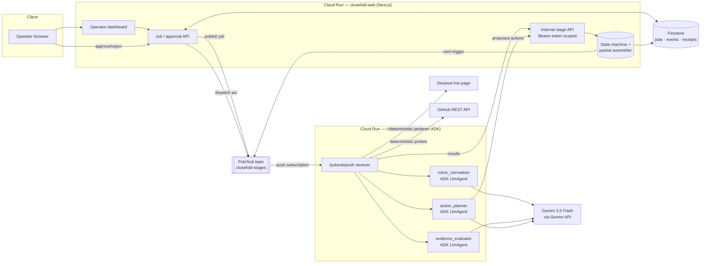

# Closefold

**Closefold is an autonomous evidence-closing agent for high-stakes submissions.** It ingests a live requirements source (a Devpost hackathon page), converts every requirement into a traceable rubric, audits an authorized GitHub repository and Google Cloud deployment for proof, proposes corrective actions behind a human approval gate, executes approved actions idempotently against real APIs, independently re-verifies that the artifacts now exist, and assembles an auditable evidence packet.

Its first demonstration audits **itself**: Closefold reads the official requirements of the All Things Agentic Hackathon, audits its own repository and Cloud Run deployment, finds its own documentation gaps (for example a missing architecture doc), opens a tracking issue and writes the missing artifact after operator approval — then re-fetches everything from GitHub to prove the gap actually closed.

## Why this is not a chatbot

Closefold runs as an asynchronous, event-driven workflow on Pub/Sub. A single job travels through eight stages across two services with durable state in Firestore at each step:

```
ingest → normalize → collect → evaluate → plan → awaiting_approval → act → verify
```

- The agent detects gaps; it does not wait to be asked.
- Risky external effects (writing files into the repository) are gated by a deterministic policy engine and require explicit human approval in the dashboard.
- Verification is mechanical: a rubric item is marked verified only when a fresh fetch of the underlying artifact (GitHub blob digest, HTTP 200 probe) proves it — never because a model said so.

## Architecture



### Separation of concerns

| Concern | Where | Interface |
|---|---|---|
| Requirement ingestion | `agent/closefold_agent/devpost.py` | fetch + deterministic HTML extraction |
| Rubric normalization | ADK agent `rubric_normalizer` | structured output (`RubricOutput`) |
| Evidence collection | `agent/closefold_agent/probes.py` | observations: URL, status, sha256 digest, excerpt |
| Policy evaluation | ADK agent `evidence_evaluator` | one finding per rubric item, cited URLs only |
| Action planning | ADK agent `action_planner` | typed action proposals |
| Approval gating | web `src/lib/policy.ts` | deterministic risk rules — the model cannot self-authorize |
| External action | `agent/closefold_agent/github_client.py` | idempotent upserts/issues + audit receipts |
| Verification | `agent/closefold_agent/verify.py` | mechanical predicates over freshly fetched artifacts |
| Packet assembly | web `src/lib/packet.ts` | unresolved-gap ledger |

## Technology

- **Gemini 3.5 Flash** (`gemini-3.5-flash`, GA) through the Gemini API for requirement extraction, evidence classification, and action planning — three schema-constrained ADK agents.
- **Google ADK** (Python) for the agent workflow: `google.adk.agents.llm_agent.Agent` with structured output schemas, run through the ADK `Runner`.
- **Cloud Run** hosts both services (web: Next.js standalone build; agent: Python container).
- **Firestore** persists job state, stage events, approvals, receipts, verifications, and the final packet.
- **Pub/Sub** drives every stage transition; transient failures nack for redelivery, permanent failures are recorded as visible unresolved gaps.

## Local spin-up

Prerequisites: Node 20+, Python 3.12+, [`gcloud` CLI](https://cloud.google.com/sdk/docs/install). The emulators make local development free and hermetic.

```bash
git clone https://github.com/danielAsaboro/closefold.git
cd closefold
npm install
cp .env.example .env.local   # fill GEMINI_API_KEY and GITHUB_TOKEN
./scripts/dev.sh             # starts Firestore + Pub/Sub emulators, web :3000, worker
```

Open http://localhost:3000, enter the Devpost URL, your `owner/repo`, optionally a Cloud Run URL, and start a job. The worker pulls stages from the Pub/Sub emulator using the identical dispatch path as production.

Run tests:

```bash
npm test                     # TypeScript: policy gate, idempotency, state machine, packet assembly
npm run test:agent           # Python: ingestion parsing, verification predicates, failure classification
```

## Deploy to Google Cloud

One-time bootstrap, then repeatable deploys:

```bash
gcloud auth login
export PROJECT_ID=your-project-id
export REGION=us-central1
export GEMINI_API_KEY=...    # picked up by setup.sh to create Secret Manager entries
export GITHUB_TOKEN=...

./infra/setup.sh             # enables APIs, Firestore, topics, SAs, IAM, secrets
./infra/deploy.sh            # builds both services from source via Cloud Build,
                             # deploys to Cloud Run, wires the push subscription
```

Both services scale to zero. The web service is public-read (dashboard), the agent service accepts only Pub/Sub push invocations authenticated via OIDC + Cloud Run IAM. Secrets stay in Secret Manager; nothing sensitive lives in the repo or client bundle.

## Security and reliability model

- **Minimum permissions**: two dedicated service accounts; web gets datastore + pubsub publisher, agent gets secretAccessor only. GitHub token is scoped to the audited repository.
- **Operator gate**: job creation, approval decisions, and retries require an `x-operator-token` header (`OPERATOR_TOKEN` secret) — the public dashboard can be browsed read-only, but only token holders mutate. The dashboard stores the token in localStorage and attaches it automatically.
- **Idempotency**: every corrective action carries a stable key derived from `(jobId, actionId, contentHash)`; file upserts compare digests before writing, issue creation searches for a marker before creating.
- **Audit receipts**: each execution records outcome (`applied` / `already_applied` / `failed`), the artifact URL, and the commit/blob SHA in Firestore.
- **Resumable state**: jobs survive worker crashes; Pub/Sub redelivery plus server-side stage guards (`assertTransition`) prevent duplicated side effects. Duplicate receipts are suppressed by idempotency key, and permanently failed jobs can be retried from their failure point via the dashboard.
- **Failure honesty**: permanent failures (bad permissions, invalid payloads) are preserved as visible unresolved gaps; errors never become simulated success.

## Project structure

```
closefold/
├── src/
│   ├── app/                    # Next.js App Router: dashboard + public/internal APIs
│   ├── components/             # Operator console (jobs, approvals, evidence ledger)
│   └── lib/                    # types, config, Firestore/Pub/Sub adapters,
│                               # policy engine, state machine, packet assembler
├── agent/
│   ├── closefold_agent/        # FastAPI worker, ADK agents, Devpost/GitHub/GCP integrations
│   └── tests/                  # pytest units for parsing, verification, failures
├── infra/                      # setup.sh (one-time) and deploy.sh (revisions)
├── scripts/dev.sh              # emulator-based local loop
└── tests/                      # vitest units for policy/idempotency/state/packet
```

## Status

Built for the [All Things Agentic Hackathon](https://allthingsagentichackathon.devpost.com/) — **The Taskmaster** category. Known limitations are tracked honestly in the dashboard itself: anything Closefold cannot mechanically verify shows up as an unresolved gap rather than a green checkmark.
