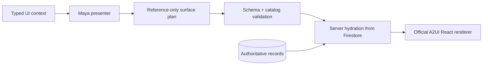

The Harmonia Console combines operator conversation with a living editorial canvas. Gemini may select and arrange a fixed vocabulary of trusted A2UI components; it cannot generate JavaScript, HTML, CSS, arbitrary React components, or executable callbacks.

<CardGroup cols={3}>
  <Card title="Conversation" icon="comments">Chaptered messages, safe activity summaries, tool state, and context.</Card>
  <Card title="Working canvas" icon="objects-column">Drafts, media, evidence, plans, comparisons, and persisted artifacts.</Card>
  <Card title="Approval dock" icon="user-check">Server-owned controls bound to durable job and action identities.</Card>
</CardGroup>

## Trusted rendering pipeline



Unknown components, invalid entity references, non-HTTP citations, and preview URLs outside authenticated routes fail validation. Hydration supplies actual draft text, transcript excerpts, policy state, costs, asset routes, and receipts from authenticated records; the model never supplies those authoritative values.

## Durable streaming

`POST /api/chat/stream` creates a tenant-scoped Firestore run. Each schema-validated NDJSON record receives a monotonic sequence number and is persisted before delivery. A disconnected client resumes with:

```text
GET /api/chat/runs/{runId}/events?after={sequence}
```

This is durable transport streaming. It does not claim direct provider-token streaming when the underlying compatibility handler returns a complete Gemini result.

## Upload boundary

Cloud uploads use a tenant-scoped resumable Cloud Storage URL. The server independently verifies object size and content type before an attachment becomes usable. Local development follows the same attachment state machine with the local artifact store.

| Upload | Current behavior |
|---|---|
| video/audio | may seed the existing ingest and transcription pipeline when the prompt selects `create_job` |
| image/document | retained and rendered as context; not silently claimed as analyzed |
| upload without task intent | stores the attachment but creates no job |

<Warning>Generated approval detail is presentation only. The unchanged server-protected approval dock validates persisted `jobId + actionId` and remains the sole dashboard decision control.</Warning>

See [Operator Interfaces](/interfaces) for surface behavior and [Approvals & Audit](/approval-and-audit) for authority.

