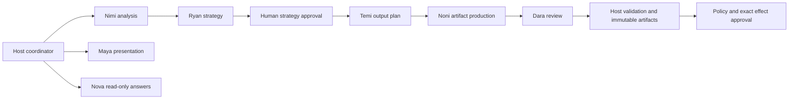

Harmonia uses native Strands Agents SDK for bounded judgment. The deterministic host owns stage selection, state transitions, validation and effect authority. AgentCore Runtime hosts cognitive calls; DynamoDB remains durable workflow truth.

## Team topology

Seven product specialists cover analysis (Nimi), strategy (Ryan), planning (Temi), writing and production (Noni), review (Dara), presentation (Maya), and operator liaison (Nova). Routing, context assembly, research variants, artifact tasks and Dream synthesis are separate registrations rather than additional product personas.

Noni and Dara are invoked separately by deterministic orchestration. Host code bounds repairs and review revisions, validates complete outputs and persists accepted identities. A model never declares the workflow complete or chooses a new stage on its own. See the [full registration inventory](/reference/agent-runtime-inventory).

## Native invocation and hooks

`build_agent_team()` returns project-owned `SpecialistDefinition` values. `HarmoniaCoordinator.select()` chooses one allowed definition from validated host state. `LocalStrandsTeamRuntime` creates a fresh `strands.Agent` with `BedrockModel`, `structured_output_model`, `AuthorityHooks`, `callback_handler=None`, and `retry_strategy=None`, then calls `invoke_async()`.

The worker's cloud path uses native `invoke_agent_runtime` with a strict tenant envelope and stable hashed runtime session identity. The AgentCore application validates that envelope and runs the same specialist implementation. Runtime session identity does not grant replay authority or replace persisted operation state.

`BeforeModelCallEvent` enforces provider admission and records request hashes. `BeforeToolCallEvent` validates the selected tool, exact host-issued research request and one-shot authority before dispatch. `AfterToolCallEvent` records typed evidence. Structured output is validated again at the host boundary before mutation.

## Skills and tools

Skills are host-preloaded method text with activation provenance. There are no skill-loader tools. Source text, skill text and model output cannot grant permission or fabricate evidence.

Research-enabled Ryan receives `ryan_gateway_search`. Research-enabled Nimi receives exactly the authorized public Gateway or private Knowledge Base tool after host filtering. Ordinary analysis and strategy have no research tools. Temi receives a host-built planning snapshot rather than model-visible database reads. Noni's copywriter variant can search verified publications; its artifact producer has no research tools. Dara and Maya have no tools.

Nova's liaison registration exposes six scoped read tools. `nova_context_answer` instead answers from an already supplied context record without tools. Neither task can approve, publish or mutate. The exact names and schemas are listed in the runtime inventory.

## Memory, recovery and authority

AgentCore Memory retrieves advisory context in the exact workspace and brand namespace. Eligible writes are derived from typed operator decisions and verified outcomes with durable provenance. Memory cannot override current source authority, approval, job state or cost limits.

Transient provider errors may receive bounded policy-controlled retries. Invalid typed results receive bounded repair from the original trusted input. Missing authority, exhausted repair or uncertain effects remain visible failures or reconciliation work. An expired claim is not permission to repeat a paid or public operation.

## Evidence status

Native SDK contracts and host enforcement have local tests. Authenticated AgentCore, Bedrock, Gateway, Memory and complete AWS workflow execution remain pending-live. No earlier edition's deployment or model receipts establish success here.

Implementation: `agent/harmonia_agent/agents.py`, `agent/harmonia_agent/team_runtime.py`, `agent/harmonia_agent/agentcore_app.py`, `agent/harmonia_agent/memory_bank.py`.
