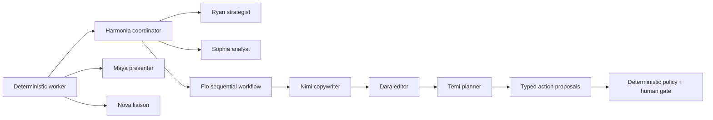

Harmonia uses Google ADK for bounded judgment inside a deterministic asynchronous workflow. Agent Engine hosts cognition; it does not own durable workflow state or external-effect authority.

<CardGroup cols={3}>
  <Card title="Harmonia" icon="route">Routes one bounded task to the appropriate specialist.</Card>
  <Card title="Ryan & Sophia" icon="magnifying-glass-chart">Produce grounded strategy and multimodal analysis.</Card>
  <Card title="Flo" icon="people-arrows">Runs Nimi → Dara → Temi in a fixed sequential workflow.</Card>
</CardGroup>

## Team topology

| Role | Responsibility | Allowed context | Prohibited authority |
|---|---|---|---|
| Harmonia | exact specialist routing | typed invocation state | answer the specialist task, approve, publish |
| Ryan | strategy and signal synthesis | supplied brief, signals, eligible memory | invent evidence, mutate state, publish |
| Sophia | transcript and video understanding | bounded source media, timed transcript | invent quotes or frames, approve, publish |
| Nimi | platform-native drafting | validated analysis and strategy | create facts, approve, publish |
| Dara | one constraint-preserving revision | Nimi drafts and source references | replace evidence or create new authority |
| Temi | deterministic-shape action planning | Dara-reviewed drafts | approve or execute proposed actions |
| Maya | A2UI layout selection | typed entity references and UI context | emit executable UI or mutate records |
| Nova | read-only operational answers | allow-listed tools and skills | write Firestore, retry jobs, approve, publish |

## Managed invocation lifecycle

<Steps>
  <Step title="Reconstruct a typed snapshot">The worker reads authoritative Firestore state and creates a serializable invocation seed.</Step>
  <Step title="Create a namespaced session">Agent Engine receives a session keyed by workspace, user, and job. The retrieved session object is treated as read-only.</Step>
  <Step title="Stream typed deltas">ADK `output_key` values and event `state_delta` records carry specialist handoffs. Required keys are validated before use.</Step>
  <Step title="Persist validated results">Deterministic routes write accepted results to Firestore. Session state alone cannot advance the workflow.</Step>
  <Step title="Delete the session">The ephemeral managed session is removed after success or failure.</Step>
</Steps>

<Warning>Agent state, chat history, and Memory Bank are context—not authorization. Only durable policy, approval, claim, receipt, and verification records control effects.</Warning>

## Versioned ADK skills

Nova loads a skill before calling its associated tools. Every skill constrains tool selection, evidence use, retry, and escalation.

| Skill | Purpose | Allowed tools |
|---|---|---|
| `trend-scan` | find grounded public topics | trend signal fetch/search |
| `signal-watch` | explain current signals and operator feed | trend signals and operator feed |
| `engagement-insights` | summarize measured post performance | engagement insights |
| `posting-schedule` | suggest evidence-based UTC windows | engagement insights, operator feed, posting windows |
| `job-status` | answer scoped operational status questions | job status |

See [Agent tool contracts](/tool-contracts) for the exact envelope and permission model.

