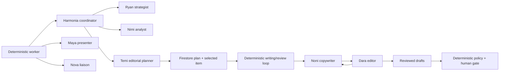

Harmonia uses Google ADK for bounded judgment inside a deterministic asynchronous workflow. Agent Engine hosts cognition; it does not own durable workflow state or external-effect authority.

<CardGroup cols={3}>
  <Card title="Harmonia" icon="route">Owns intent routing, authoritative reads, handoffs, bounded correction, and escalation.</Card>
  <Card title="Nimi & Ryan" icon="magnifying-glass-chart">Produce grounded analysis, strategy, and content plans.</Card>
  <Card title="Temi" icon="calendar-days">Agentically operationalizes an approved Ryan strategy; deterministic code persists the plan and selects one item.</Card>
  <Card title="Writing & review" icon="people-arrows">Deterministic code runs separate typed Noni and Dara calls for the selected item.</Card>
</CardGroup>

## Team topology

| Role | Responsibility | Allowed context | Prohibited authority |
|---|---|---|---|
| Harmonia | intent routing, exact specialist selection, host-owned handoff construction, authority-read orchestration, bounded correction, and escalation | typed invocation state plus authenticated host reads | invent identifiers, digests, tool results, approval, receipts, verification, or provider outcomes |
| Nimi | source evidence analysis: exact moments and qualified source/context/performance/memory angles | typed transcript/frame evidence, verified performance, eligible Memory Bank facts, one bounded method skill, and optional request-bound grounded context | use skill prose as evidence, invent evidence or trends, define strategy, write final copy, approve, schedule, publish, or treat memory/search as authority |
| Ryan | agentic strategy and source-grounded content briefs | typed Nimi analysis, company/campaign context, verified performance, eligible Memory Bank facts | write final copy, mutate calendars, approve, publish |
| Temi | agentic editorial operationalization: sequencing, cadence, supported channels/formats, windows, deadlines, dependencies, and priorities | exact human-approved Ryan strategy, Nimi evidence, one immutable Firestore planning snapshot, local method skill, and request-bound read views | invent strategy/evidence, search, read outside the snapshot, write final copy, approve, mutate external calendars, schedule externally, publish |
| Noni | platform-native writing and revision | one selected Temi item, its exact Ryan brief, referenced Nimi evidence, local writing guidance, verified prior publications, and brief-scoped public sources | redefine strategy, search trend feeds, access Memory Bank, inspect the rest of the plan, create facts, approve, publish |
| Maya | reference-only interface composition | exact typed job/entity catalog; deterministic host hydration from Firestore | invent IDs or state, emit lifecycle placeholders, expose payloads, approve, publish, verify, or mutate workflow |
| Dara | complete seven-dimension assessment and bounded correction issues | exact Noni draft, immutable production input, and allow-listed editing-method guidance | cite skill prose as evidence, author workflow metadata, rewrite copy, replace evidence, request a third pass, or create authority |
| Maya | A2UI layout selection | typed entity references and UI context | emit executable UI or mutate records |
| Nova | read-only operational answers | allow-listed tools and skills | write Firestore, retry jobs, approve, publish |

## Managed invocation lifecycle

<Steps>
  <Step title="Reconstruct a typed snapshot">The worker reads authoritative Firestore state and creates a serializable invocation seed.</Step>
  <Step title="Create or resume a namespaced session">Agent Engine receives a deterministic session identity derived from the user and operation. Existing managed state is read without mutating the caller's payload; a missing session is created once and reused after process restarts.</Step>
  <Step title="Stream typed deltas">ADK `output_key` values and event `state_delta` records carry specialist handoffs. Required keys are validated before use.</Step>
  <Step title="Persist validated results">Deterministic routes write accepted results to Firestore. Session state alone cannot advance the workflow.</Step>
  <Step title="Reconcile interrupted streams">If the managed event stream terminates after state was durably committed, Harmonia rereads the session and accepts only validated state that differs from the invocation seed. Missing or partial output remains a visible failure.</Step>
</Steps>

<Warning>Agent state, chat history, and Memory Bank are context—not authorization. Only durable policy, approval, claim, receipt, and verification records control effects.</Warning>

Invalid specialist output crosses the coordinator boundary as a structured `AgentContractError` with a role, stable code, safe operator message, and optional schema path. The failure pipeline retains these fields in its typed envelope and durable activity event; model output and validation payloads never become operator-facing error text.

## Coordination and bounded course correction

Harmonia is the deterministic ADK root. The host places the exact requested specialist in session state; the root resolves that registered child directly instead of asking a model to invent or rewrite an agent transfer. Every specialist receives a host-created `harmonia.handoff/v1` envelope and acknowledgement bound to the specialist, operation ID, input digest, and output contract.

Specialists return semantic judgment only. Application code computes canonical identifiers and digests, materializes artifacts, records actual callback/tool evidence, and decides whether an output can advance. A missing authority read, invalid evidence reference, malformed structured result, or incomplete acknowledgement produces a safe repair code. Harmonia can run at most two issue-specific corrections against the original trusted input. A third invalid result becomes `agent_output_repair_exhausted` and is escalated; the coordinator does not broaden authority, change the goal, or fabricate a successful handoff.

Structured output remains enabled for tool-capable Gemini specialists. Tool calls and output schemas are complementary boundaries: callbacks record real tool execution, while the schema constrains the final semantic result. Skill activation records are identified separately and are never presented as tool results.

## Activity and telemetry

Every specialist invocation emits a strict metadata-only log, trace, and metric projection with tenant, job, operation, agent, stage, model, timing, usage counts, outcome, and real W3C trace/span IDs. Tool activity is projected only when ADK supplies real trace context. Unknown fields fail validation, and the schema cannot carry prompts, model responses, transcripts, drafts, credentials, or provider bodies.

The projection powers **Monitoring → Agent activity**. Native ADK OpenTelemetry signals continue to Cloud Logging, Cloud Monitoring, and Cloud Trace; the projection is a bounded operator view, not a replacement for those backends and never an authority source.

## Versioned ADK skills

Nimi loads exactly one `nimi-analysis-skills` skill and at least one relevant allow-listed analysis
reference. This filesystem skill contains method guidance only.

Dara loads exactly one `dara-editing-skills` skill and at least one approved editing reference before
review. The seven references route editorial triage, grounding and claims, structure and clarity,
brief/voice/audience fit, platform/CTA usability, safety and inclusion, and bounded feedback. Dara
has no search, Memory Bank, workflow, approval, or effect tool. Runtime callbacks record the actual
loader sequence and deterministic validation rejects missing, duplicate, out-of-order, or
unapproved resources. The guidance can shape editorial judgment but cannot serve as factual
evidence, a brand constraint, or authority.

Noni loads exactly one `noni-writing-skills` skill and at least one approved writing reference before
drafting.

Temi loads exactly one `temi-editorial-planning-skills` skill and at least one of six allow-listed
planning references. Its separate read-only tools expose commitments, capacity, asset readiness,
verified posting-window observations, calendar projection state, and blocked dependencies from the
exact immutable planning snapshot. The trace must load references before data reads and every read
must match the request's snapshot ID. Skill prose is methodology and never evidence.

## Runtime research tools

Search and internal-data reads are tools, not skills. Nimi's optional native Google Search and
Vertex AI Search tools run in isolated request-bound child agents. The runtime validates a separate
research trace and native grounding metadata before persistence.

Noni has two separate read capabilities:
`search_verified_publications` for tenant-scoped posts with applied receipts and successful
verification, and native ADK `google_search` through an isolated brief-bound research agent.
It has no trend-feed, Memory Bank, approval, or effect tool. The eleven references cover thought leadership,
hooks and introductions, MECE structure, case studies, storytelling, bad-content diagnosis,
persuasion, outlining, titles and headlines, convincing content, and narrated short-form video scripts. Skill guidance shapes writing
but never counts as evidence for a factual claim. Research-derived claims and URLs must cite the
live tool evidence ID recorded in the actual trace.

Nova loads exactly one skill before any data tool. The runtime records the real
skill/tool envelopes in managed ADK state and rejects answers whose selected
skill, tool sequence, retry behavior, status, errors, claims, or evidence IDs
do not match that trace. Skill prose guides reasoning; deterministic validation
enforces the boundary.

| Skill | Purpose | Allowed tools |
|---|---|---|
| `trend-scan` | find grounded public topics | trend signal fetch/search |
| `signal-watch` | explain current signals and operator feed | trend signals and operator feed |
| `engagement-insights` | summarize measured post performance | engagement insights |
| `posting-schedule` | suggest evidence-based UTC windows | engagement insights, operator feed, posting windows |
| `job-status` | answer scoped operational status questions | job status |

See [Agent tool contracts](/tool-contracts) for the exact envelope and permission model.
