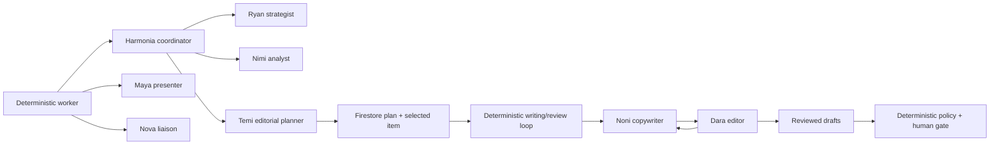

Harmonia uses Google ADK for bounded judgment inside a deterministic asynchronous workflow. Agent Engine hosts cognition; it does not own durable workflow state or external-effect authority.

<CardGroup cols={3}>
  <Card title="Harmonia" icon="route">Routes one bounded task to the appropriate specialist.</Card>
  <Card title="Nimi & Ryan" icon="magnifying-glass-chart">Produce grounded analysis, strategy, and content plans.</Card>
  <Card title="Temi" icon="calendar-days">Agentically operationalizes an approved Ryan strategy; deterministic code persists the plan and selects one item.</Card>
  <Card title="Writing & review" icon="people-arrows">Deterministic code runs separate typed Noni and Dara calls for the selected item.</Card>
</CardGroup>

## Team topology

| Role | Responsibility | Allowed context | Prohibited authority |
|---|---|---|---|
| Harmonia | exact specialist routing | typed invocation state | answer the specialist task, approve, publish |
| Nimi | transcript, video, and performance analysis | bounded source media and verified evidence | invent evidence, define strategy, approve, publish |
| Ryan | agentic strategy and source-grounded content briefs | typed Nimi analysis, company/campaign context, verified performance, eligible Memory Bank facts | write final copy, mutate calendars, approve, publish |
| Temi | agentic editorial operationalization: sequencing, cadence, supported channels/formats, windows, deadlines, dependencies, and priorities | exact human-approved Ryan strategy, Nimi evidence, capabilities, commitments, capacity, and observed posting windows | invent strategy/evidence, write final copy, use tools, approve, mutate external calendars, schedule externally, publish |
| Noni | platform-native writing and revision | one deterministically selected Temi item, its exact Ryan brief, and referenced Nimi evidence | inspect the rest of the plan, create facts, approve, publish |
| Dara | complete seven-dimension assessment and bounded correction issues | exact Noni draft and immutable production input | author workflow metadata, rewrite copy, replace evidence, request a third pass, or create authority |
| Maya | A2UI layout selection | typed entity references and UI context | emit executable UI or mutate records |
| Nova | read-only operational answers | allow-listed tools and skills | write Firestore, retry jobs, approve, publish |

## Managed invocation lifecycle

<Steps>
  <Step title="Reconstruct a typed snapshot">The worker reads authoritative Firestore state and creates a serializable invocation seed.</Step>
  <Step title="Create a namespaced session">Agent Engine receives a session keyed by workspace, user, and job. The retrieved session object is treated as read-only.</Step>
  <Step title="Stream typed deltas">ADK `output_key` values and event `state_delta` records carry specialist handoffs. Required keys are validated before use.</Step>
  <Step title="Persist validated results">Deterministic routes write accepted results to Firestore. Session state alone cannot advance the workflow.</Step>
  <Step title="Delete the session">The ephemeral managed session is removed after success or failure.</Step>
</Steps>

<Warning>Agent state, chat history, and Memory Bank are context—not authorization. Only durable policy, approval, claim, receipt, and verification records control effects.</Warning>

## Versioned ADK skills

Nova loads a skill before calling its associated tools. Every skill constrains tool selection, evidence use, retry, and escalation.

| Skill | Purpose | Allowed tools |
|---|---|---|
| `trend-scan` | find grounded public topics | trend signal fetch/search |
| `signal-watch` | explain current signals and operator feed | trend signals and operator feed |
| `engagement-insights` | summarize measured post performance | engagement insights |
| `posting-schedule` | suggest evidence-based UTC windows | engagement insights, operator feed, posting windows |
| `job-status` | answer scoped operational status questions | job status |

See [Agent tool contracts](/tool-contracts) for the exact envelope and permission model.
