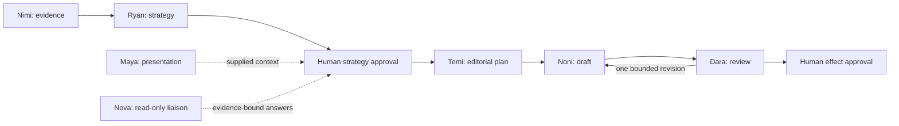

Harmonia's host coordinator owns workflow control. Seven named specialists supply bounded judgment: Nimi, Ryan, Temi, Noni, Dara, Maya and Nova. Dedicated routing, research, artifact and Dream registrations reuse the appropriate model policy without gaining workflow authority.

| Role | Purpose | Default model |
|---|---|---|
| [Nimi](/agents/nimi) | Evidence analysis and authorized research | Amazon Nova 2 Lite |
| [Ryan](/agents/ryan) | Strategy proposals | Claude Sonnet 4.6 |
| [Temi](/agents/temi) | Editorial planning from a host snapshot | Claude Sonnet 4.6 |
| [Noni](/agents/noni) | Drafts and semantic artifacts | Claude Sonnet 4.6 |
| [Dara](/agents/dara) | Editorial review | Claude Sonnet 4.6 |
| [Maya](/agents/maya) | A2UI reference plans | Claude Haiku 4.5 |
| [Nova](/agents/nova) | Scoped read-only answers | Claude Haiku 4.5 |

Method skills are preloaded. The model never loads files to activate a skill. Tool registrations are explicit: Temi receives its snapshot in the request; Noni's draft variant can read verified prior publications; Nimi and Ryan receive research tools only in host-selected research variants. Nova has six bounded reads.

Every transition, budget reservation, approval, provider claim and verification receipt belongs to host code. AgentCore sessions contain invocation context, while DynamoDB owns durable workflow state. No authenticated AWS deployment or provider rehearsal is claimed.

See [runtime inventory](/reference/agent-runtime-inventory) for all fourteen registrations and [Strands](/platform/agents/strands) for the request lifecycle.
