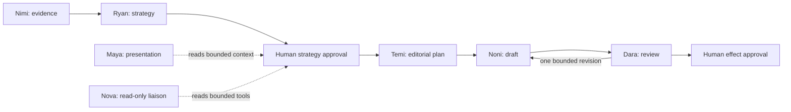

Harmonia separates agentic judgment from deterministic workflow authority. Agents analyze,
strategize, plan, write, review, compose interfaces, and answer read-only questions. Firestore and
application code own stage transitions, approvals, scheduling effects, publishing, receipts, and
verification.

| Agent | Runtime role | Output | Filesystem skills | Separate runtime tools |
|---|---|---|---|---|
| [Nimi](/agents/nimi) | Evidence analyst | `SourceAnalysis` | `nimi-analysis-skills` | Isolated Google Search; optional isolated Vertex AI Search |
| [Ryan](/agents/ryan) | Content strategist | `StrategistResult` / `ContentStrategy` | `ryan-strategy-skills` | Isolated request-bound Google Search |
| [Temi](/agents/temi) | Editorial planner | `EditorialPlan` | `temi-editorial-planning-skills` | Six immutable planning-snapshot reads |
| [Noni](/agents/noni) | Copywriter | `ContentDraft` | `noni-writing-skills` | Verified-publication read; isolated Google Search |
| [Dara](/agents/dara) | Editor | `EditorialAssessment` | `dara-editing-skills` | None |
| [Maya](/agents/maya) | A2UI presenter | `SurfacePlan` | None | None |
| [Nova](/agents/nova) | Read-only liaison | `LiaisonAnswer` | Five routing skills | Six bounded read-only tools |

<Warning>Memory Bank provides eligible context only. It never grants approval, permissions, policy exceptions, or authority to cause an external effect.</Warning>
