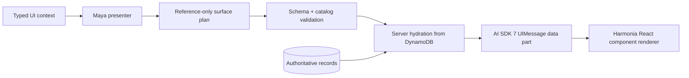

The Harmonia Console combines operator conversation with a living editorial canvas. Bedrock may select and arrange a fixed vocabulary of trusted AI SDK components; it cannot generate JavaScript, HTML, CSS, arbitrary React components, or executable callbacks.

<CardGroup cols={3}>
  <Card title="Conversation" icon="comments">Chaptered messages, safe activity summaries, tool state, and context.</Card>
  <Card title="Working canvas" icon="objects-column">Typed content artifacts, media, evidence, plans, comparisons, and receipts.</Card>
  <Card title="Approval dock" icon="user-check">Server-owned controls bound to durable job and action identities.</Card>
</CardGroup>

## Trusted rendering pipeline



Unknown components, wrong-job or invented entity references, duplicate references, component/reference mismatches, authoritative titles, non-HTTP citations, and preview URLs outside authenticated routes fail validation. `ApprovalReview` is valid only in the approval slot for exactly one action that the supplied context marks pending. Loading, empty, unresolved, and failure components are host-owned and cannot be selected by Maya. Hydration supplies exact content-artifact payloads, transcript excerpts, policy state, costs, asset routes, and receipts from authenticated records; the model never supplies those authoritative values.

## Durable streaming

`POST /api/chat/stream` creates a tenant-scoped DynamoDB run and returns the official AI SDK UI message SSE protocol. Each validated chunk derives from a monotonic durable event persisted before delivery. `@ai-sdk/react` uses a custom `ChatTransport` to reconnect through:

```text
GET /api/chat/runs/{runId}/events?after=-1&stream=1
```

Each projected `UIMessageChunk` is stored directly with its own monotonic chunk sequence before delivery. The stable assistant message and data-part IDs make replay replace the in-flight message without duplicating text or surfaces. Persisted UI message history is validated with `validateUIMessages` plus Harmonia's strict surface schema before use. This is durable transport streaming. It does not claim direct provider-token streaming when the bounded provider invocation returns a complete result.

## Upload boundary

Cloud uploads use a tenant-scoped presigned S3 request. The server verifies the completed object size, declared type, and magic bytes, then keeps it in the S3 quarantine prefix until the private malware scanner returns a complete clean verdict for every byte. Infected objects and content mismatches are deleted; scanner outages remain quarantined and unavailable. Local development follows the same fail-closed boundary with versioned MinIO.

| Upload | Current behavior |
|---|---|
| video/audio | registered as direct sources and normalized into timed evidence when the prompt selects `create_job` |
| document | registered as a direct source and normalized into page/paragraph evidence |
| image | retained and rendered as conversation context; standalone image analysis is not claimed |
| upload without task intent | stores the attachment but creates no job |

<Warning>Generated approval detail is presentation only. The unchanged server-protected approval dock validates persisted `jobId + actionId` and remains the sole dashboard decision control.</Warning>

See [Operator Interfaces](/interfaces) for surface behavior and [Approvals & Audit](/approval-and-audit) for authority.
