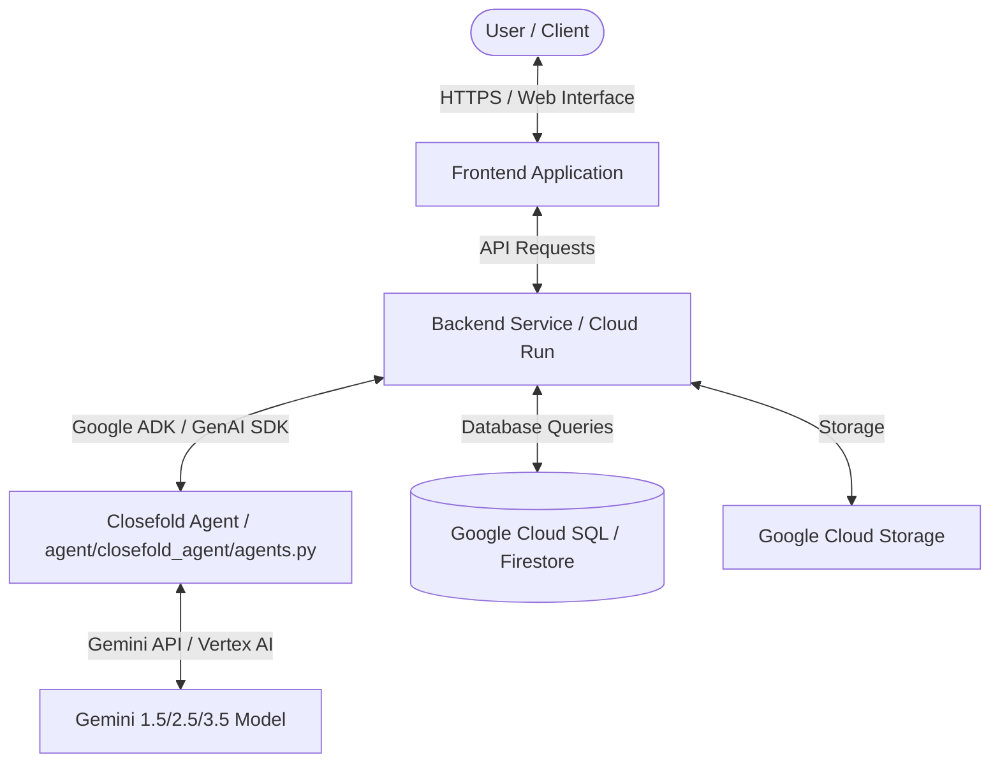

# Architecture Diagram

This document describes the system architecture of Closefold, demonstrating how the Gemini Model, Google Cloud Platform, and the Closefold Agent stack interact.

## System Architecture Diagram

## Component Breakdown

1. **Frontend Application**: Provides the user interface for interactions.
2. **Backend Service**: Developed in Python, deployed to **Google Cloud Run**. Orchestrates business logic and routes requests to the AI Agent.
3. **Closefold Agent (`agent/closefold_agent/agents.py`)**: Built using the **Google ADK / Google GenAI SDK**. It wraps LLM interactions, manages agentic tools, and maintains conversation memory.
4. **Gemini Model**: Powered by the **Gemini API / Vertex AI** (specifically using Gemini 1.5 / Gemini 2.5 / Gemini 3.5 or newer models) to perform reasoning, code understanding, and planning.
5. **Google Cloud Infrastructure**: Utilizes Google Cloud services (Cloud Run, Cloud SQL, Cloud Storage) for scalable, secure production deployment.