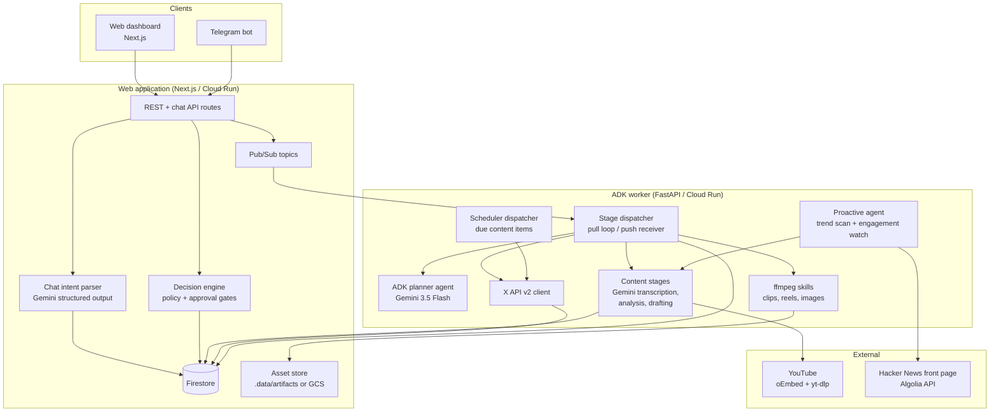

## System diagram

## Design principles

### One decision engine

Every mutating action (approve, publish, schedule) flows through the same decision layer regardless of surface — dashboard button, chat message, or Telegram inline button. Telegram approvals additionally require an explicit callback tap; parsed text alone can never execute.

### Async by Pub/Sub, state in Firestore

Each stage transition is persisted first, then a stage trigger is published. The worker consumes stages through a push subscription on Cloud Run or an identical pull loop locally against the emulators. Jobs carry their full state (`transcriptSegments`, `moments`, `angles`, `drafts`, `actions`), so any stage can resume after a crash.

### Idempotent external effects

Every executable action derives a deterministic idempotency key from `(jobId, actionId, payload)` hashed with SHA-256. Before executing, the publish stage checks existing receipts; re-delivery yields `already_applied`, never a duplicate post.

### Independent verification

Verification never trusts the executor. Published posts are re-fetched from the X API by id; exported packs are compared by digest; rendered assets are re-read from the asset store and compared byte-digests. Results land as immutable verification records on the job.

### Learnings feed forward

The learn stage measures published posts via public metrics, stores takeaways per job, and the insights feed is injected into future ideation prompts — closing the loop between what performed and what gets proposed next.
