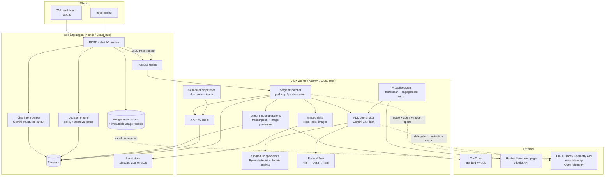

## System diagram

## Design principles

### Typed multi-agent judgment

Harmonia, the ADK root coordinator, delegates strategy to Ryan (`ryan_strategist`) and transcript analysis to Sophia (`sophia_analyst`). Drafting uses Flo (`flo_draft_workflow`), an `AgentTool` around a deterministic `SequentialAgent`: Nimi the copywriter, one revision by Dara the editor, then Temi the planner. Invocation-scoped session keys pass `copywriter_drafts`, `reviewed_drafts`, and `action_plan`; Firestore remains the durable source of truth between Pub/Sub stages.

No agent has publishing, approval, credential, or destructive tools. Temi can propose publish actions only from Dara-reviewed text; deterministic stage code adds packs and media actions before the existing human gate.

### One decision engine

Every mutating action (approve, publish, schedule) flows through the same decision layer regardless of surface — dashboard button, chat message, or Telegram inline button. Telegram approvals additionally require an explicit callback tap; parsed text alone can never execute.

### Async by Pub/Sub, state in Firestore

Each stage transition is persisted first, then a stage trigger is published. The worker consumes stages through a push subscription on Cloud Run or an identical pull loop locally against the emulators. Jobs carry their full state (`transcriptSegments`, `moments`, `angles`, `drafts`, `actions`), so any stage can resume after a crash.

The coordinator is the cognitive dispatcher, not the durable workflow engine. Pub/Sub owns asynchronous delivery and retry; Firestore owns resumable stage state, approvals, reservations, usage, receipts, and verification evidence.

### Correlated observability and cost controls

The web process creates or continues W3C context and places `traceparent`/`tracestate` in Pub/Sub attributes. The worker continues that context through `harmonia.stage.execute`, `harmonia.agent.invoke`, `harmonia.model.generate`, and `harmonia.output.validate`. Delegation is an explicit `harmonia.agent.delegate` event. Internal HTTP callbacks carry the same context.

Before dispatch, every real ADK role, transcription call, and image generation reserves a deterministic operation cost in a Firestore transaction. Successful calls finalize immutable usage records grouped by job, stage, role, and model. Retried operation IDs reuse their reservation and usage document, preventing double charging. `/api/metrics` exposes calls, units, and estimated cost by role/model plus current reserved cost.

Trace attributes are metadata-only. Harmonia disables both current and legacy ADK message-content capture and never attaches prompts, responses, transcripts, drafts, or media bytes. The trace shows the execution graph and explicit structured decisions; it does not expose private chain-of-thought.

### Idempotent external effects

Every executable action derives a deterministic idempotency key from `(jobId, actionId, payload)` hashed with SHA-256. Before executing, the publish stage checks existing receipts; re-delivery yields `already_applied`, never a duplicate post.

### Independent verification

Verification never trusts the executor. Published posts are re-fetched from the X API by id; exported packs are compared by digest; rendered assets are re-read from the asset store and compared byte-digests. Results land as immutable verification records on the job.

### Learnings feed forward

The learn stage measures published posts via public metrics, stores takeaways per job, and the insights feed is injected into future ideation prompts — closing the loop between what performed and what gets proposed next.

<Warning>
  The multi-agent code, budget enforcement, usage normalization, and metadata-only trace behavior are verified offline. Authenticated Gemini execution and exported Cloud Trace correlation remain unverified until separate live evidence is captured.
</Warning>
