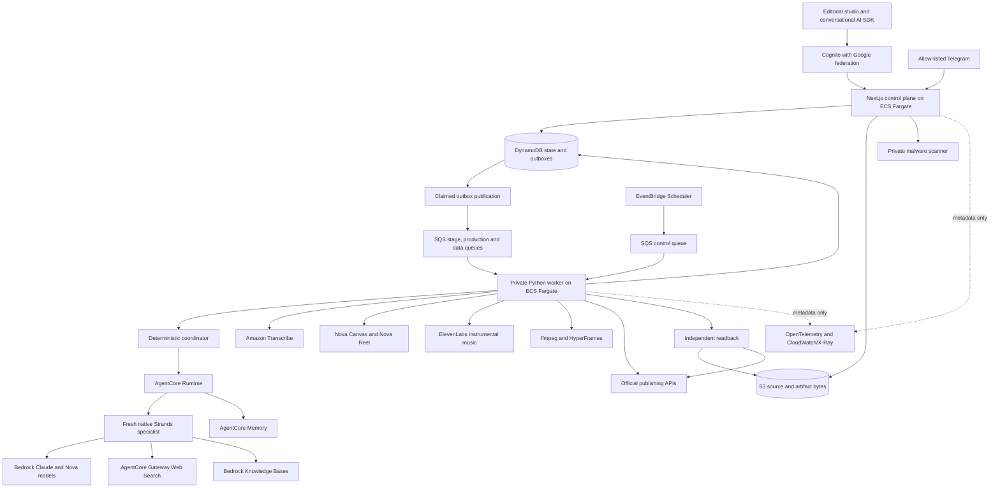

Harmonia separates bounded model judgment from durable workflow authority. Cognito authenticates operators; Next.js owns authenticated APIs and the editorial studio; a private Python worker consumes SQS work. DynamoDB stores scoped state, claims, approvals and receipts. S3 holds authorized source bytes and immutable artifacts.

<Card title="Open the interactive architecture explorer" icon="route" href="/architecture">
Explore agents, state ownership, approval boundaries, effects and verification. AWS nodes remain pending-live.
</Card>

## System diagram

## Source and cognitive boundaries

Uploads use tenant-scoped S3 object identities and a fail-closed malware verdict before becoming ready source records. The job seals source identity and digest separately from the operator brief. Transcribe provides authoritative word timing for audio/video; document and text extractors preserve typed locators. Nimi proposes only references grounded in those normalized sources. Authorized source indexing and Knowledge Base retrieval retain workspace, brand, source identity and digest filters.

Host code chooses a narrow task from validated state. Strands specialists use exact configured Bedrock models, host-preloaded skills and typed output contracts. Before-model and before-tool hooks enforce admission and research scope; post-result validation alone is insufficient. Ryan proposes strategy, human approval authorizes that strategy, Temi proposes a plan, and a bounded Noni/Dara production-review loop creates artifacts for host validation.

AgentCore Runtime session identity supports correlated invocations; it is not a durable workflow engine. AgentCore Memory is advisory and cannot manufacture current evidence, approval or execution truth. See [Agent platform](/agent-platform).

## Approval and execution

Every consequential effect binds to its current action, destination, canonical payload digest and approval. Before the provider call, the worker atomically claims the immutable operation identity. An expired unresolved claim becomes reconciliation work when the effect may have happened. Duplicate delivery returns `already_applied` with the original receipt identity; it does not create a new execution receipt. Only explicit operator replay persists a replay observation.

SQS delivery is a wake signal. Four consumers reconstruct current state before acting, renew delivery visibility while processing, and retain failed messages for recovery/redrive. EventBridge schedules control messages; it cannot grant effect authority. Outbox publication and recovery reconcile durable records rather than relying on process memory.

## Media and verification

Nova Canvas creates images. Nova Reel uses native asynchronous six-second or 12–120-second automated multishot generation. ElevenLabs generates instrumental music, default thirty seconds. Paid admission and generative-media enablement are both required, along with explicit pricing and action approval. Unknown synchronous music outcomes are not blindly replayed; Reel persists its operation ARN before polling.

ffmpeg and HyperFrames perform deterministic media rendering under the same sealed production contracts. Content packs depend on verified constituent identities. Verification rereads S3 bytes and recomputes digests; comparing two stored digest fields is insufficient. Publishing adapters independently query official provider state when supported. Export availability does not imply publication or provider readiness.

## Operator experience and evidence

The studio keeps conversation beside a living artifact canvas. Host-validated AI SDK messages reference existing entities; generated markup or callbacks are not executable UI. Authenticated approval controls preserve the same authority boundary across dashboard, chat and Telegram. Durable chat events support replay without turning historical cards into current execution authority.

Resident Dream and Wakeup cycles use scoped leases, sealed observations, budget policy and deterministic projections. Incomplete or uncertain model calls do not replay paid inference. See [Governed resident autonomy](/resident-autonomy).

This AWS edition is implemented and locally tested; deployment, authenticated provider results and complete verified export remain pending-live. Earlier Google-edition evidence is provenance, not AWS readiness proof. The CDK source is `infra/aws/stack.ts`; runtime sources include `agent/harmonia_agent/main.py` and `agent/harmonia_agent/sqs_transport.py`.
