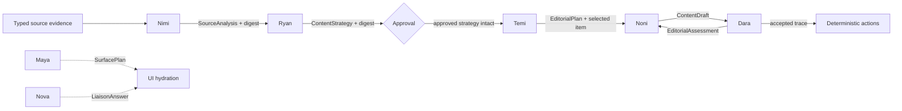

```mermaid
flowchart LR
  SRC[Typed source evidence] --> N[Nimi]
  N -->|SourceAnalysis + digest| R[Ryan]
  R -->|ContentStrategy + digest| G{Approval}
  G -->|approved strategy intact| T[Temi]
  T -->|EditorialPlan + selected item| NO[Noni]
  NO -->|ContentDraft| D[Dara]
  D -->|EditorialAssessment| NO
  D -->|accepted trace| APP[Deterministic actions]
  MAYA[Maya] -. SurfacePlan .-> UI[UI hydration]
  NOVA[Nova] -. LiaisonAnswer .-> UI
```

Each arrow carries a strict contract and closed evidence set. The application, not the downstream agent, decides whether the handoff is eligible. See [Agent contracts](/reference/agent-contracts).
