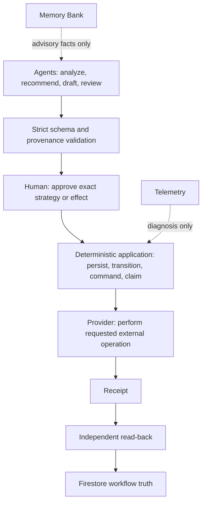

```mermaid
flowchart TB
  A[Agents: analyze, recommend, draft, review] --> V[Strict schema and provenance validation]
  V --> H[Human: approve exact strategy or effect]
  H --> D[Deterministic application: persist, transition, command, claim]
  D --> E[Provider: perform requested external operation]
  E --> R[Receipt]
  R --> I[Independent read-back]
  I --> F[Firestore workflow truth]
  M[Memory Bank] -. advisory facts only .-> A
  O[Telemetry] -. diagnosis only .-> D
```

No dotted advisory path grants authority. See the [Authority matrix](/reference/authority-matrix).
