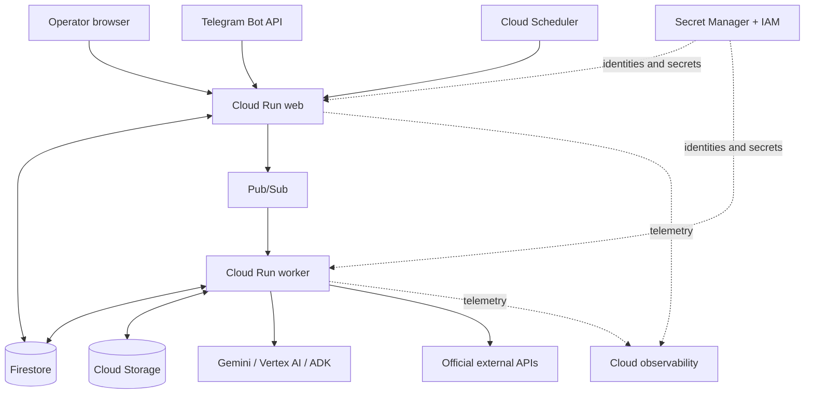

```mermaid
flowchart TB
  OP[Operator browser] --> WEB[Cloud Run web]
  TG[Telegram Bot API] --> WEB
  SCH[Cloud Scheduler] --> WEB
  WEB <--> FS[(Firestore)]
  WEB --> PS[Pub/Sub]
  PS --> WK[Cloud Run worker]
  WK <--> FS
  WK <--> ST[(Cloud Storage)]
  WK --> AI[Gemini / Vertex AI / ADK]
  WK --> EXT[Official external APIs]
  WEB -. telemetry .-> OBS[Cloud observability]
  WK -. telemetry .-> OBS
  SEC[Secret Manager + IAM] -. identities and secrets .-> WEB
  SEC -. identities and secrets .-> WK
```

Cloud Run instances remain stateless. Firestore and Cloud Storage preserve recoverable state, and IAM-authenticated calls connect runtime components. See [Deployment](/deployment).
