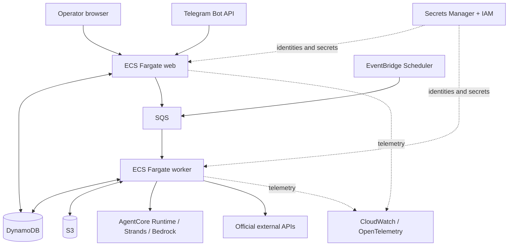

```mermaid
flowchart TB
  OP[Operator browser] --> WEB[ECS Fargate web]
  TG[Telegram Bot API] --> WEB
  SCH[EventBridge Scheduler] --> PS
  WEB <--> FS[(DynamoDB)]
  WEB --> PS[SQS]
  PS --> WK[ECS Fargate worker]
  WK <--> FS
  WK <--> ST[(S3)]
  WK --> AI[AgentCore Runtime / Strands / Bedrock]
  WK --> EXT[Official external APIs]
  WEB -. telemetry .-> OBS[CloudWatch / OpenTelemetry]
  WK -. telemetry .-> OBS
  SEC[Secrets Manager + IAM] -. identities and secrets .-> WEB
  SEC -. identities and secrets .-> WK
```

ECS Fargate instances remain stateless. DynamoDB and S3 preserve recoverable state, and IAM-authenticated calls connect runtime components. See [Deployment](/deployment).
