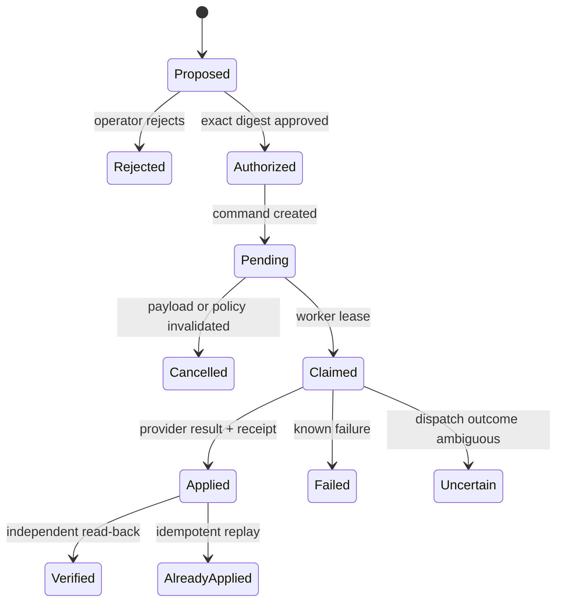

```mermaid
stateDiagram-v2
  [*] --> Proposed
  Proposed --> Rejected: operator rejects
  Proposed --> Authorized: exact digest approved
  Authorized --> Pending: command created
  Pending --> Cancelled: payload or policy invalidated
  Pending --> Claimed: worker lease
  Claimed --> Applied: provider result + receipt
  Claimed --> Failed: known failure
  Claimed --> Uncertain: dispatch outcome ambiguous
  Applied --> Verified: independent read-back
  Applied --> AlreadyApplied: idempotent replay
```

Uncertainty is visible and blocks blind replay. See [Effect contracts](/reference/effect-contracts).
