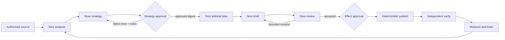

```mermaid
flowchart LR
  S[Authorized source] --> N[Nimi analysis]
  N --> R[Ryan strategy]
  R --> SG{Strategy approval}
  SG -->|approved digest| T[Temi editorial plan]
  SG -->|reject once + notes| R
  T --> NO[Noni draft]
  NO --> D[Dara review]
  D -->|bounded revision| NO
  D -->|accepted| EG{Effect approval}
  EG --> P[Deterministic publish]
  P --> V[Independent verify]
  V --> L[Measure and learn]
  L --> N
```

The production revision loop and the learning loop are distinct. Strategy and effect approvals bind different payloads and neither can be inferred by an agent. See [Pipeline](/pipeline).
