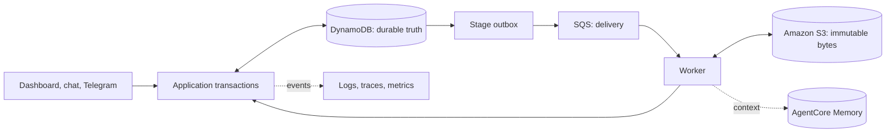

When systems disagree, DynamoDB determines workflow state; Amazon S3 determines asset bytes and its digest; an official provider read-back determines external state. See [State ownership](/state-ownership).
