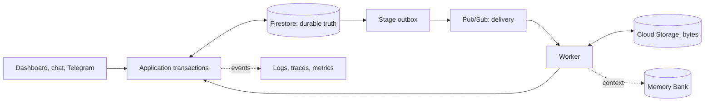

When systems disagree, Firestore determines workflow state; Cloud Storage determines asset bytes and its digest; an official provider read-back determines external state. See [State ownership](/state-ownership).
