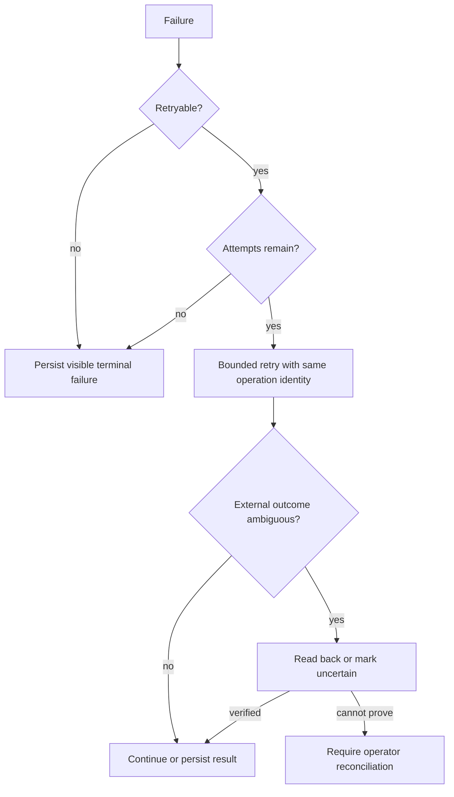

## Failure envelope

Agent and tool boundaries normalize failures into safe structured data rather than passing provider bodies downstream.

```json
{
  "category": "dependency",
  "code": "provider_unavailable",
  "message": "The provider is temporarily unavailable.",
  "retryable": true,
  "stage": "understand",
  "attempt": 1,
  "maxAttempts": 3
}
```

Credentials, prompts, transcripts, drafts, private provider payloads, and stack traces are excluded from operator and model-facing envelopes.

## Classification and action

| Category | Typical examples | Automatic action |
|---|---|---|
| validation | malformed schema, unsupported source | terminal; surface correction |
| authorization | missing consent, wrong tenant, expired non-refreshable token | terminal; operator action |
| policy | budget, safety, or approval violation | terminal; preserve decision context |
| dependency | timeout, `429`, provider `5xx` | bounded retry when explicitly retryable |
| conflict | ETag mismatch, concurrent state change | read-back or transaction reconciliation |
| uncertain effect | claim expired without a receipt, ambiguous calendar provisioning | fail closed; operator reconciliation |
| internal | invariant or protocol failure | terminal and observable |

## Recovery sequence



Retries reuse stable operation and idempotency identities. They do not manufacture a new action or bypass human approval.

## Agent-output correction

Provider retries and semantic correction are separate. The Google client handles explicitly retryable transport failures within the configured request timeout. Once a specialist returns a result, Harmonia validates its schema, evidence, authority reads, and handoff acknowledgement exactly once.

For a correctable contract failure, Harmonia creates a safe, issue-specific repair request from the original trusted input. It permits at most two corrections by the same specialist. The repair may name a required read-only tool and exact authority identity, but it cannot change the requested task, introduce identifiers, grant approval, or add evidence. After two unsuccessful corrections, Harmonia persists `agent_output_repair_exhausted` and escalates to the operator.

Managed-session stream interruption uses read-after-failure recovery. Harmonia rereads the deterministic session and considers only state committed beyond the original seed. Recovered output still passes the normal specialist validator; an empty or partial delta is not success.

## Effect recovery states

| Claim result | Meaning | Provider call allowed? |
|---|---|---|
| `execute` | caller owns a live claim | yes, once |
| `in_progress` | another delivery owns the claim | no |
| `already_applied` | original receipt exists | no; return original receipt identity |
| `uncertain` | lease expired without final proof | no; operator reconciliation required |
| `paused` | job control state blocks new work | no; resume with an epoch-fenced operator command |
| `cancelled` | job cancellation blocks new work | no; cancellation is irreversible for that job |

Only the explicit **Prove duplicate suppression** control creates replay evidence. Ordinary duplicate delivery suppresses the provider call without creating a new replay record.

<Warning>A visible failure is a valid terminal outcome. Harmonia never converts an unavailable provider, missing credential, unverifiable effect, or exhausted retry into simulated success.</Warning>

See [Approvals & Audit](/approval-and-audit) for claim-before-effect ordering and [Authenticated vertical-slice evidence](/evidence-runbook) for proof requirements.
