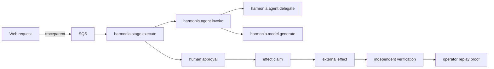

Harmonia carries one W3C trace context across the web control plane, SQS delivery, Strands invocation, model usage, approval, effect claim, external effect, verification, and replay proof.

The web and worker propagate W3C OpenTelemetry traces to local AWS Distro for OpenTelemetry collectors, which export to AWS X-Ray. ECS logs are delivered to CloudWatch Logs. Harmonia also writes a deliberately smaller, validated activity projection to tenant-scoped DynamoDB so operators can inspect agent activity without browser access to AWS telemetry.

## Correlation identifiers

| Identifier | Purpose |
|---|---|
| `traceId` | end-to-end causal graph |
| `traceparent` / `tracestate` | W3C transport across HTTP and SQS |
| `sqsMessageId` | delivery and redelivery evidence |
| `operationId` | stable logical attempt across retries |
| `actionId` | approved proposal identity |
| `idempotencyKey` | exact effect payload identity |
| `claimId` | exclusive execution lease |
| `receiptId` | immutable applied-effect evidence |
| `verificationId` | independent observed-outcome evidence |

## Span vocabulary

- `harmonia.stage.execute`
- `harmonia.agent.invoke`
- `harmonia.agent.delegate`
- `harmonia.model.generate`
- `harmonia.output.validate`

Usage, budget reservation, approval, claim, effect, verification, and replay records retain enough identifiers to reconstruct lineage without placing private content in telemetry.

## Durable agent activity

The Monitoring **Agents** view reads structured activity from the existing tenant-scoped DynamoDB job event stream. Each record identifies its kind (`handoff`, `tool_call`, `retry`, or `failure`), status, responsible role, safe public message, operation, and trace. Handoffs identify both roles; retries and failures carry a stable code, category, retryability, and bounded attempt counts.

Events are written only after the corresponding typed artifact passes deterministic validation and persistence. They describe what happened but cannot advance a stage, approve content, or authorize an effect.

## Native Strands signals

When `HARMONIA_TELEMETRY_ENABLED=true`, `OTEL_EXPORTER_OTLP_ENDPOINT` is required. Fargate task sidecars receive OTLP/gRPC on loopback and export metadata-only traces using task IAM roles. CloudWatch Logs receives application stdout and collector logs. The AgentCore role has the managed runtime's logging, tracing, and metrics permissions; actual export remains an authenticated rehearsal check.

Python resource attributes include service name, AWS region, release, and environment. `HARMONIA_TELEMETRY_SAMPLE_RATE` controls parent-based sampling. Content capture is disabled before inference. Native provider instrumentation and application event projections remain separate from execution authority.

## Operator activity explorer

Open **Monitoring → Agent activity** to query the safe DynamoDB projection. It supports:

- log, trace, and metric modes;
- agent, stage, outcome, severity, model, tool, job, trace, time-window, and free-text filters;
- opaque forward cursors with previous/next navigation;
- nested parent/child spans by trace ID;
- per-agent latency, invocation, failure, token, inference-call, and tool-call summaries for the current filtered page.

The internal writer authenticates before parsing and rejects records whose workspace or brand differs from the active tenant. Browser queries derive tenancy from the authenticated session. Records receive a 30-day ISO deletion timestamp plus a numeric `retentionEpochSeconds`; the DynamoDB table enables TTL on `ttlEpochSeconds`, which the repository projects from validated records.

<Warning>The activity projection is operational telemetry, not durable workflow truth or authorization. DynamoDB job, approval, claim, receipt, and verification records remain authoritative.</Warning>

## Privacy boundary

<Tabs>
  <Tab title="Recorded">
    IDs, stages, roles, handoff endpoints, tool names, model names, counts, attempt numbers, durations, policy versions, outcomes, safe error codes/categories, and timestamps.
  </Tab>
  <Tab title="Excluded">
    Prompts, model responses, transcripts, draft text, source media, credentials, provider bodies, and hidden chain-of-thought.
  </Tab>
</Tabs>

Both current and legacy Strands message-content capture settings are disabled in cloud configuration.

Projection failures never change a workflow outcome, and their exception messages are not logged. The projection schema has no fields for prompts, responses, transcript text, drafts, provider bodies, credentials, or chain-of-thought.

<Info>Local trace-contract tests prove propagation and redaction behavior. A judge-facing claim still requires authenticated CloudWatch traces or log exports correlated with the same DynamoDB records.</Info>

See [How to capture AWS deployment evidence](/cloud-proof) for the live capture sequence.
