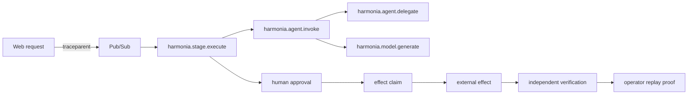

Harmonia carries one W3C trace context across the web control plane, Pub/Sub delivery, ADK invocation, model usage, approval, effect claim, external effect, verification, and replay proof.

The worker configures Google ADK's native OpenTelemetry providers for Cloud Logging, Cloud Monitoring, and Cloud Trace. Harmonia also writes a deliberately smaller, validated activity projection to tenant-scoped Firestore so operators can inspect agent activity without browser access to Google Cloud telemetry.

## Correlation identifiers

| Identifier | Purpose |
|---|---|
| `traceId` | end-to-end causal graph |
| `traceparent` / `tracestate` | W3C transport across HTTP and Pub/Sub |
| `pubsubMessageId` | delivery and redelivery evidence |
| `operationId` | stable logical attempt across retries |
| `actionId` | approved proposal identity |
| `idempotencyKey` | exact effect payload identity |
| `claimId` | exclusive execution lease |
| `receiptId` | immutable applied-effect evidence |
| `verificationId` | independent observed-outcome evidence |

## Span vocabulary

- `harmonia.stage.execute`
- `harmonia.agent.invoke`
- `harmonia.agent.delegate`
- `harmonia.model.generate`
- `harmonia.output.validate`

Usage, budget reservation, approval, claim, effect, verification, and replay records retain enough identifiers to reconstruct lineage without placing private content in telemetry.

## Native ADK signals

When `HARMONIA_TELEMETRY_ENABLED=true`, the worker enables all three ADK Google Cloud exporters:

- structured ADK and GenAI logs in Cloud Logging;
- ADK invocation, workflow, tool, latency, and token metrics in Cloud Monitoring;
- `invoke_agent`, `invoke_workflow`, `execute_tool`, and `generate_content` spans in Cloud Trace.

The worker resource identifies `harmonia-agent`, the Google Cloud project, the Cloud Run revision, and the deployment environment. `HARMONIA_TELEMETRY_SAMPLE_RATE` controls parent-based trace sampling. See Google's ADK references for [logging](https://adk.dev/observability/logging/), [metrics](https://adk.dev/observability/metrics/), and [traces](https://adk.dev/observability/traces/).

## Operator activity explorer

Open **Monitoring → Agent activity** to query the safe Firestore projection. It supports:

- log, trace, and metric modes;
- agent, stage, outcome, severity, model, tool, job, trace, time-window, and free-text filters;
- opaque forward cursors with previous/next navigation;
- nested parent/child spans by trace ID;
- per-agent latency, invocation, failure, token, inference-call, and tool-call summaries for the current filtered page.

The internal writer authenticates before parsing and rejects records whose workspace or brand differs from the active tenant. Browser queries derive tenancy from the authenticated session. Records receive a 30-day deletion timestamp; production must configure a Firestore TTL policy on `retentionDeleteAfter` for the `agent_activity` collection group.

<Warning>The activity projection is operational telemetry, not durable workflow truth or authorization. Firestore job, approval, claim, receipt, and verification records remain authoritative.</Warning>

## Privacy boundary

<Tabs>
  <Tab title="Recorded">
    IDs, stages, roles, model names, counts, unit/cost values, policy versions, outcomes, safe error categories, and timestamps.
  </Tab>
  <Tab title="Excluded">
    Prompts, model responses, transcripts, draft text, source media, credentials, provider bodies, and hidden chain-of-thought.
  </Tab>
</Tabs>

Both current and legacy ADK message-content capture settings are disabled in cloud configuration.

Projection failures never change a workflow outcome, and their exception messages are not logged. The projection schema has no fields for prompts, responses, transcript text, drafts, provider bodies, credentials, or chain-of-thought.

<Info>Local trace-contract tests prove propagation and redaction behavior. A judge-facing claim still requires authenticated Cloud Trace or log exports correlated with the same Firestore records.</Info>

See [How to capture Google Cloud deployment evidence](/cloud-proof) for the live capture sequence.
