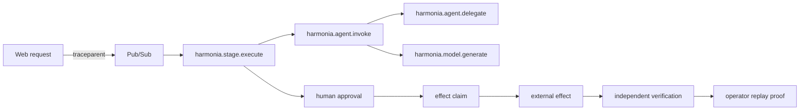

Harmonia carries one W3C trace context across the web control plane, Pub/Sub delivery, ADK invocation, model usage, approval, effect claim, external effect, verification, and replay proof.

## Correlation identifiers

| Identifier | Purpose |
|---|---|
| `traceId` | end-to-end causal graph |
| `traceparent` / `tracestate` | W3C transport across HTTP and Pub/Sub |
| `pubsubMessageId` | delivery and redelivery evidence |
| `operationId` | stable logical attempt across retries |
| `actionId` | approved proposal identity |
| `idempotencyKey` | exact effect payload identity |
| `claimId` | exclusive execution lease |
| `receiptId` | immutable applied-effect evidence |
| `verificationId` | independent observed-outcome evidence |

## Span vocabulary

- `harmonia.stage.execute`
- `harmonia.agent.invoke`
- `harmonia.agent.delegate`
- `harmonia.model.generate`
- `harmonia.output.validate`

Usage, budget reservation, approval, claim, effect, verification, and replay records retain enough identifiers to reconstruct lineage without placing private content in telemetry.

## Privacy boundary

<Tabs>
  <Tab title="Recorded">
    IDs, stages, roles, model names, counts, unit/cost values, policy versions, outcomes, safe error categories, and timestamps.
  </Tab>
  <Tab title="Excluded">
    Prompts, model responses, transcripts, draft text, source media, credentials, provider bodies, and hidden chain-of-thought.
  </Tab>
</Tabs>

Both current and legacy ADK message-content capture settings are disabled in cloud configuration.

<Info>Local trace-contract tests prove propagation and redaction behavior. A judge-facing claim still requires authenticated Cloud Trace or log exports correlated with the same Firestore records.</Info>

See [How to capture Google Cloud deployment evidence](/cloud-proof) for the live capture sequence.

