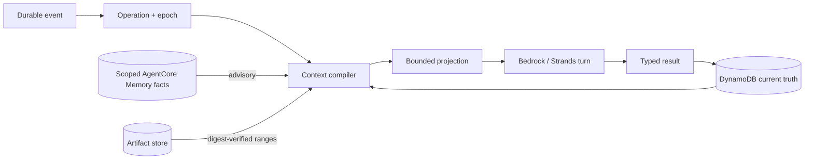

Imagine Harmonia has been following a startup campaign for weeks. It has analysed long videos,
proposed strategy, generated drafts, received corrections, and observed what was eventually approved.
Then a new event arrives: a scheduled post is due.

This is the moment when many agent systems become unreliable. The useful context is scattered across
an enormous transcript. A summary may mention an obsolete draft. A memory may describe another brand.
A tool result may have been trimmed. The worker may die halfway through publishing. When it restarts,
the model may not know whether the post already went live.

Harmonia is designed around a different premise:

> The conversation may disappear. The work, authority, and evidence must not.

This page follows that scheduled post from wakeup to recovery. Along the way, it explains how Harmonia
addresses **Context rot**, **Memory rot**, and execution ambiguity without pretending that a larger
prompt is durable state.

## 1. The event arrives before an agent is awake

The scheduled wake does not reopen an immortal chat session. It enters a versioned event inbox with a
stable source ID, payload digest, trust label, correlation ID, and optional causal parent.

Inbox acceptance and operation creation happen together in DynamoDB. If SQS delivers the same
message twice, both deliveries converge on the same event and operation identities. There is now an
authoritative answer to the first recovery question—*did Harmonia begin this work?*—before a model is
called.

The operation starts with a goal, acceptance criteria, replay policy, retry budget, and epoch. A worker
may claim it for a bounded lease. Every mutation after that claim must carry the same operation ID and
epoch. If another worker later takes over, its newer epoch fences the first worker out.

<Info>
SQS, EventBridge Scheduler, Telegram, and approved provider webhooks can all wake Harmonia. They provide
work signals, not memory and not permission to publish.
</Info>

## 2. Harmonia rebuilds the present instead of replaying the past

The new worker does not stuff the complete event history into Bedrock. It asks DynamoDB for current
durable state and compiles a fresh, deterministic context projection.

The distinction matters. A chronological transcript tells the model everything that happened,
including drafts that were rejected and assumptions that were superseded. A projection tells it what
is true **now**, why that truth is authoritative, and where omitted evidence can be recovered.

### Authority comes first

The compiler orders information by consequence rather than recency:

1. the tenant, operation identity, and epoch;
2. the goal digest and acceptance criteria;
3. the active policy version, approval IDs, and unresolved effects;
4. the current strategy, plan, draft, and evidence revision digests;
5. trusted durable observations;
6. clearly delimited external or model-produced material; and
7. bounded AgentCore Memory facts, labeled non-authoritative.

These authority fields cannot be compacted away. A polished summary cannot replace an approval. A
retrieved memory cannot select the current draft. A model assertion cannot manufacture a receipt.

The projection itself is reproducible. Its canonical manifest records the compiler version, operation
epoch, policy, model, current revisions, evidence, and artifact references. That manifest produces a
stable digest, rendered digest, and projection ID. Change any consequential input and the identity
changes with it.



The matching contracts live in `src/lib/contextProjections.ts`,
`src/lib/contextProjectionStore.ts`, and `agent/harmonia_agent/context_projection.py`. Every
stage-level Strands invocation and managed chat run enters through this projection boundary.

## 3. The transcript is too large, but the evidence is not lost

Suppose the source-analysis tool returned thousands of lines. Keeping all of them in every subsequent
prompt wastes tokens and makes the relevant constraints harder to find. Permanently deleting the
middle would be cheaper, but it would make later recovery guesswork.

Harmonia uses **prune + spill** instead.

The complete result is written as a tenant-scoped artifact with its content type, byte count, trust
label, producer, retention class, and SHA-256 digest. The prompt keeps a bounded head/tail preview and
an opaque artifact ID. If the agent later needs the missing detail, it can request a bounded byte range;
the runtime checks tenant scope and digest before returning it.

This gives compaction a different meaning. The prompt becomes smaller, but the system has not
forgotten. What left the immediate context remains addressable while retention permits.

Artifact state also makes interrupted writes honest:

```text
writing -> ready
        -> failed
```

A partial artifact never masquerades as evidence. Missing, failed, expired, or digest-invalid content
becomes visible recovery work. The compiler does not invent the omitted middle. The implementation is
in `src/lib/artifacts.ts` and `src/lib/artifactStore.ts`.

## 4. Memory returns a lesson, not a command

The worker may now retrieve a fact learned from an earlier campaign: perhaps the operator consistently
prefers evidence-led openings over hype. That can improve the next draft, but only if it belongs to the
same workspace and brand and points back to eligible durable evidence.

This is Harmonia's defense against Memory rot. AgentCore Memory writes are allowlisted and typed. Eligible
facts come from explicit operator preferences, approved decisions, independently verified outcomes,
or measured learnings with durable record IDs. Raw transcripts, prompts, draft copy, credentials,
provider bodies, errors, unverified claims, and facts without lineage are rejected.

Retrieval is bounded by count and characters. Wrong-scope or malformed memories fail visibly instead
of entering the projection. Even a valid result carries less authority than current DynamoDB state.

<Warning>
AgentCore Memory is advisory. It can influence judgment; it cannot approve an effect, advance an operation,
choose the current revision, repair a receipt, or reconstruct DynamoDB after a crash.
</Warning>

This is why Harmonia keeps four different kinds of continuity instead of calling all of them “memory”:

| Layer | What it preserves | What it cannot do |
|---|---|---|
| Strands invocation state | typed handoffs inside one cognitive turn | survive as workflow truth |
| AgentCore Runtime session | continuity for one scoped operation | own leases or authorize effects |
| DynamoDB | current workflow, authority, receipts, and failures | provide generative judgment |
| AgentCore Memory | evidence-linked lessons across sessions | override current durable state |

The detailed eligibility and retention boundaries are documented in
[Sessions, history, and memory](/session-memory).

## 5. The model proposes an action, but does not perform it yet

With its bounded projection assembled, Bedrock and the Strands team can decide what content work is needed.
Their output still crosses a typed validation boundary before deterministic workflow code accepts it.

When an approved external action is ready, Harmonia writes **intent before effect**. The effect command
captures the exact approved payload digest and operation fence before the provider is contacted:

```text
prepared -> dispatched -> observed -> applied | failed | unknown
```

Now imagine the provider receives the publish request, but the worker loses its network connection
before the response is committed. Calling that a failure would invite an automatic retry and possibly
publish twice. Calling it success would fabricate evidence.

Harmonia records it as `unknown`.

Unknown is not an error label to hide. It is a durable statement that the provider may have acted and
that automatic execution must stop until reconciliation or human resolution supplies evidence.

## 6. The worker dies, and the conversation dies with it

The process restarts with no trustworthy recollection of its last instruction. That is acceptable,
because the next worker does not recover from recollection.

A model-free recovery wake scans bounded pages under deadline, retry, and cost ceilings. It finds the
expired operation, abandoned inbox/outbox claim, observed result without a receipt, unverified receipt,
or broken artifact. Depending on replay policy and state, it may:

- release safe work for another attempt;
- requeue an inbox or outbox record;
- request provider reconciliation;
- enqueue independent verification; or
- require an operator decision.

It may not execute an unknown external effect.

Recovery records are idempotent for one crash, but not forever. Their identities include the persisted
**attempt generation**. Repeating a scan for attempt 1 emits nothing new; if a replacement worker later
claims attempt 2 and also crashes, attempt 2 receives fresh recovery authority. Without that generation,
an old recovery record could leave a later crash stuck indefinitely.

Meanwhile, epoch fencing rejects the original worker if it wakes up and tries to finalize stale work.
The replacement worker compiles a new projection from current state rather than trusting the abandoned
conversation.

## 7. A human resolves what automation cannot know

If provider read-back proves the post exists, Harmonia can bind that observation to a receipt and
verification record. If the provider proves it never began, the command can safely return to
`prepared` for a new fenced attempt.

When neither conclusion is independently available, the operator receives four explicit choices:

- confirm applied using ready, digest-verified evidence;
- confirm not applied and permit a new attempt;
- create separate compensation work; or
- cancel without claiming success.

The resolution records the human identity, authentication ID, reason, operation goal digest, command
payload digest, evidence digests, and decision digest. Compensation is separate work; it is never a
hidden side effect of resolving the original operation.

At this point the job has survived event redelivery, bounded context, retrieved memory, a lost worker,
and ambiguous provider state. No single conversation had to survive with it.

## 8. The next job starts with less context and more continuity

Weeks later, another source arrives. Harmonia does not replay this job's full transcript. It starts a
new operation, retrieves only eligible same-scope learnings, selects the latest durable revisions, and
builds another bounded projection.

That is the core optimisation:

- prompt volume depends on the bounded projection, not the age of the agent;
- current authority survives trimming;
- large evidence remains retrievable by artifact and digest;
- stale memory cannot overwrite present state;
- worker death does not erase progress; and
- ambiguous effects stop instead of becoming duplicate actions.

The result is not an immortal conversation. It is a system where conversation loss does not imply work
loss, memory retrieval does not imply authority, and process death does not imply starting over.

## What the fault benchmark proves

`scripts/verify-durable-runtime.ts` injects faults at ten boundaries: before and after inbox acceptance,
operation claim, projection persistence, model result, effect preparation, provider dispatch, provider
response, receipt commit, and verification.

| Metric | Deterministic result |
|---|---:|
| Audited failure boundaries | 10/10 |
| Duplicate transitions | 0 |
| Duplicate external effects | 0 |
| Stale writes rejected | 1 |
| Ambiguous post-dispatch outcomes preserved as unknown | 1 |
| Authority constraints surviving reconstruction | 3 |
| Artifact digest checks | 2 |
| Prompt projection characters in the fixed benchmark | 178 |

Two independent benchmark executions produce byte-identical JSON. DynamoDB integration tests cover
concurrent claims, recurring recovery attempts, artifact integrity, stale epochs, effect ambiguity,
and operator resolution.

<Info>
This does not prove multi-week uptime, authenticated AgentCore Memory behavior, cloud IAM correctness,
provider availability, or successful external publication. Those claims require a deployed soak run,
real elapsed time, and independent provider read-back. The benchmark proves the implemented state
transitions and reconstruction contract—not the availability of systems outside it.
</Info>

Continue with [Failure and recovery](/failure-recovery) for the state-by-state reference,
[State ownership](/state-ownership) for database boundaries, and
[Observability](/observability) for the evidence surfaces.
