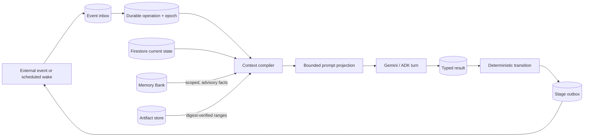

Harmonia does not try to keep one model conversation alive for hours or weeks. It keeps the **work**
alive while model calls, workers, sessions, and prompt windows remain replaceable.

<CardGroup cols={2}>
  <Card title="Context rot" icon="message-slash">
    Relevant constraints, tool results, and decisions become diluted, truncated, or contradicted as
    an invocation transcript grows.
  </Card>
  <Card title="Memory rot" icon="brain">
    Old summaries, stale revisions, unverified claims, or facts from the wrong scope are retrieved as
    if they were current truth.
  </Card>
</CardGroup>

The optimisation target is therefore not maximum prompt retention. It is **bounded reconstruction**:
each cognitive turn receives the smallest reproducible view that preserves current truth, authority,
unresolved risk, and retrievable evidence.

## The continuity model



Firestore is authoritative workflow truth. Agent Engine sessions provide invocation continuity.
Memory Bank is advisory cross-session context. The artifact store preserves large values omitted from
the prompt. Pub/Sub, Scheduler, Telegram, and approved provider webhooks are wake signals—not memory
and not authorization.

## Deterministic context projection

Every stage-level ADK call and managed chat run compiles a fresh context projection. The compiler is
deterministic: the same canonical manifest produces the same manifest digest, rendered digest, and
projection identity.

### Authority comes first

The projection orders information by consequence rather than chronology:

1. tenant and operation identity;
2. operation epoch, goal digest, and acceptance criteria;
3. policy version, approval IDs, and unresolved effects;
4. current strategy, plan, draft, and evidence revisions;
5. trusted durable observations;
6. explicitly delimited external or model-generated content; and
7. bounded, non-authoritative Memory Bank facts.

Authority fields are non-compactable. A summary or retrieved memory cannot replace an approval,
current revision digest, operation fence, effect command, receipt, or verification record. Changing
the epoch, policy, current revision, evidence, or compiler version changes the projection identity.

The TypeScript manifest and persistence contract lives in `src/lib/contextProjections.ts` and
`src/lib/contextProjectionStore.ts`. The matching Python compiler and ADK integration live in
`agent/harmonia_agent/context_projection.py` and `agent/harmonia_agent/agents.py`.

## Prune + spill instead of permanent loss

Large tool results do not consume the prompt indefinitely. Harmonia uses **prune + spill**:

- Persist the complete result as a tenant-scoped artifact before relying on it.
- Record byte length, content type, trust label, producer, retention class, and SHA-256 digest.
- Keep a bounded head/tail preview plus an opaque artifact ID in the projection.
- Retrieve only bounded byte ranges when a later operation needs detail.
- Verify the artifact digest and tenant scope before returning content.

This reduces prompt volume without making compaction destructive. A missing, incomplete, expired, or
digest-invalid artifact remains a visible recovery problem; the compiler never invents the omitted
middle. Artifact records move through `writing -> ready|failed`, preventing a partially written value
from being presented as durable evidence. The implementation is in `src/lib/artifacts.ts` and
`src/lib/artifactStore.ts`.

## Preventing memory rot

Memory Bank writes are allowlisted, typed, evidence-linked, and scoped to the exact workspace and
brand. Eligible memories include explicit operator preferences, approved decisions, independently
verified outcomes, and measured learnings with durable record IDs.

Raw transcripts, prompts, drafts, credentials, provider bodies, errors, unverified claims, and legacy
facts without lineage are rejected. Retrieval is count- and character-bounded. Wrong-scope or
malformed results fail visibly instead of entering the prompt.

<Warning>
Memory Bank is advisory. It may improve judgment, but it cannot authorize an effect, advance a job,
repair a receipt, choose the current revision, or reconstruct Firestore after a crash.
</Warning>

See [Sessions, history, and memory](/session-memory) for the complete eligibility and retention matrix.

## Execution continuity after compaction or crashes

A good prompt is insufficient if the worker forgets whether it already acted. Harmonia therefore
separates cognitive continuity from execution continuity.

Every source event has a version, stable source ID, payload digest, trust label, correlation ID, and
optional causation ID. Inbox acceptance and operation creation are atomic. A worker claim increments
a durable epoch; every later mutation must present the same operation ID and epoch. A stale worker is
rejected even if it resumes with a valid old transcript.

For external actions, Harmonia writes **intent before effect**:

```text
prepared -> dispatched -> observed -> applied | failed | unknown
```

An ordinary error after dispatch becomes `unknown`, not a retryable failure. Recovery never guesses
whether the provider acted. It reconciles with provider state or waits for an operator decision backed
by digest-verified evidence.

## Bounded recovery

The model-free recovery wake scans finite pages under explicit deadline, retry, and cost ceilings. It
can requeue safe inbox/outbox work, release an expired safe operation, request reconciliation, enqueue
verification, or create operator work. It cannot execute an unknown external effect.

Recovery identities include the persisted **attempt generation**. Repeating the scan for the same
crash is idempotent; a later crash of the same operation receives new recovery authority. This avoids
both duplicate repair and the subtler failure where an old recovery record prevents a newer attempt
from being recovered.

See [Failure and recovery](/failure-recovery) for state-specific behavior and
[State ownership](/state-ownership) for the database boundaries.

## What was measured

`scripts/verify-durable-runtime.ts` injects failures at ten durable boundaries: before and after inbox
acceptance, operation claim, projection persistence, model result, effect preparation, provider
dispatch, provider response, receipt commit, and verification.

| Metric | Deterministic result |
|---|---:|
| Audited failure boundaries | 10/10 |
| Duplicate transitions | 0 |
| Duplicate external effects | 0 |
| Stale writes rejected | 1 |
| Ambiguous post-dispatch outcomes preserved as unknown | 1 |
| Authority constraints surviving reconstruction | 3 |
| Artifact digest checks | 2 |
| Prompt projection characters in the fixed benchmark | 178 |

Two independent executions produce byte-identical benchmark JSON. Firestore integration tests also
exercise concurrent claims, stale epochs, recurring recovery attempts, artifact integrity, effect
ambiguity, and operator resolution.

<Info>
These results prove the implemented state transitions and deterministic benchmark. This does not prove multi-week uptime,
authenticated Memory Bank behavior, cloud IAM correctness, provider availability,
or successful external publication. Those require a deployed soak run and independent provider
read-back. See [Observability](/observability) for the evidence surfaces.
</Info>

## Why this is an optimisation

The design improves several axes together:

- **Quality:** current revisions and authority survive transcript trimming.
- **Token use:** prompt volume is bounded rather than proportional to runtime age.
- **Recoverability:** omitted results remain addressable by artifact and digest.
- **Safety:** stale workers and ambiguous effects cannot silently advance state.
- **Latency and cost:** model-free recovery and low-complexity bookkeeping avoid unnecessary model calls.
- **Auditability:** every projection, event, operation, effect, receipt, and recovery action has a stable identity.

The result is not an immortal conversation. It is a runtime where conversation loss does not imply
work loss, memory retrieval does not imply authority, and process death does not imply starting over.
