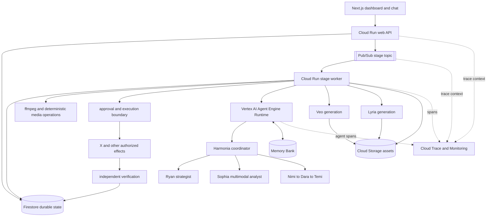

# Managed Multi-Model Agent Platform Design

> **Historical design — superseded 2026-08-28.** Role names, models, and runtime assignments here record an earlier proposal and are not current product claims. Use [`docs/reference/agent-runtime-inventory.mdx`](../../reference/agent-runtime-inventory.mdx) and [`docs/architecture.mdx`](../../architecture.mdx) for the maintained contract.

**Status:** Approved architecture, pending implementation plan

**Date:** 2026-08-23

**Scope:** Harmonia cognitive runtime, persistent agent context, telemetry, model routing, multimodal analysis, and generated media

## Problem

Harmonia currently has a typed Google ADK hierarchy, but every role resolves to one configured Gemini model. The team shares invocation-local state, while Firestore carries durable workflow state. Audio is sent to Gemini for transcription and images can be generated, but the analyst reasons over transcript JSON rather than the original video, audio, and visual frames. The application records business events and receipts, but it has no OpenTelemetry traces, managed Agent Engine deployment, Memory Bank integration, per-agent usage accounting, or Gemma, Veo, or Lyria execution paths.

The result is a reliable asynchronous application with named agent roles, not yet a heterogeneous, observable, persistent multi-model agent system.

## Goals

1. Preserve Pub/Sub and Firestore as Harmonia's durable workflow control plane.
2. Deploy the ADK cognitive team to Vertex AI Agent Engine Runtime for managed agent execution.
3. Add Memory Bank for secure, brand-scoped context across jobs and operator sessions.
4. Add OpenTelemetry traces spanning web requests, Pub/Sub transitions, worker stages, agent delegations, model calls, validation, media operations, publishing, and verification.
5. Route each cognitive role to a model selected for capability, latency, and cost instead of applying one model globally.
6. Give the analyst actual multimodal evidence: source audio/video, sampled frames, transcript, and metadata.
7. Integrate Gemma for an open-model writing role and ShieldGemma for independent generated-image safety evaluation.
8. Integrate Veo and Lyria as optional, approval-gated, budget-limited media actions.
9. Record estimated and observed cost, latency, token usage, and outcome by model and role.
10. Preserve the existing human approval boundary, idempotency behavior, verification rules, and public job-stage API.

## Non-goals

- Agents do not receive publishing, approval, credential-management, or destructive tools.
- Agent Engine does not replace the Pub/Sub stage machine, Firestore job state, media worker, policy engine, publisher, or verifier.
- Memory Bank does not become the source of truth for jobs, approvals, receipts, or facts about external actions.
- Tracing does not capture or expose private chain-of-thought. It captures the execution graph, explicit structured decisions, model and tool metadata, state transitions, errors, usage, and latency.
- Veo and Lyria do not run automatically from an unapproved model suggestion.
- No provider or model failure silently falls back to another model or to deterministic fixture output.
- This design does not claim live integration until each production path has separate captured evidence.

## Selected Architecture

Harmonia will use a hybrid topology.



### Why hybrid

Pub/Sub plus Firestore already provides explicit stages, retry control, permanent-failure visibility, resumability, and an auditable approval boundary. Agent Engine adds a managed home for cognitive execution, sessions, memory, evaluation, and traces. Keeping these concerns separate avoids turning a model runtime into a fragile business-process engine.

The Cloud Run worker remains responsible for large media files, ffmpeg, polling media operations, deterministic action execution, and independent verification. Agent Engine remains responsible for model delegation and structured judgment.

## Stable Application Interfaces

The worker preserves the existing internal entry points:

```python
async def analyze_with_team(input: AnalystInput) -> AnalysisResult: ...
async def strategize_with_team(input: StrategistInput) -> StrategistResult: ...
async def draft_with_team(input: DraftWorkflowInput) -> DraftWorkflowResult: ...
```

They will depend on a runtime abstraction:

```python
class TeamRuntime(Protocol):
    async def analyze(self, input: AnalystInput) -> AnalysisResult: ...
    async def strategize(self, input: StrategistInput) -> StrategistResult: ...
    async def draft(self, input: DraftWorkflowInput) -> DraftWorkflowResult: ...
```

Implementations:

- `LocalAdkTeamRuntime`: ADK Runner plus invocation-scoped session service for local development and deterministic tests.
- `AgentEngineTeamRuntime`: calls the deployed ADK application, propagates trace context, validates returned state, and never performs a model fallback.

The runtime is selected explicitly by deployment configuration. A missing or unavailable configured runtime is a visible failure.

## Model Routing

Each role receives its own model configuration. A global `MODEL_ID` no longer controls the entire team.

| Role | Default target | Reason |
|---|---|---|
| Coordinator | Gemini 3.5 Flash-Lite | Low-cost structured routing |
| Chat intent parser | Gemini 3.5 Flash-Lite | High-volume narrow classification |
| Ryan strategist | Gemini 3.5 Flash | Evidence synthesis and campaign reasoning |
| Sophia analyst | Gemini 3.5 Flash multimodal | Video, audio, image, and transcript understanding |
| Nimi copywriter | Gemma 3 12B IT on a Vertex endpoint | Genuine open-model writing role and stylistic diversity |
| Dara editor | Gemini 3.5 Flash | Constraint preservation and source-grounded revision |
| Temi planner | Gemini 3.5 Flash-Lite | Narrow schema-constrained planning |
| Image generator | Gemini 3.1 Flash Image | Dedicated image-generation model |
| Image safety evaluator | ShieldGemma 2 | Independent text-and-image safety judgment |
| B-roll generator | Veo 3.1 Lite | Cost-conscious short video generation |
| Reel soundtrack generator | Lyria 3 Clip | Short-form social soundtrack generation |

Model configuration is represented by a versioned catalog. Each entry contains provider, model resource, supported modalities, usage unit, effective pricing date, rate source, timeout, and task eligibility. Pricing is never embedded in prompts.

Gemma endpoint cost is recorded separately from serverless token charges. The cost ledger must distinguish observed request usage from allocated endpoint infrastructure cost rather than presenting a false per-token comparison.

### Failure behavior

- If a configured role model is unavailable, the role fails visibly.
- If Gemma is enabled and its endpoint fails, Nimi does not silently switch to Gemini.
- If a response violates its Pydantic contract, the invocation is a permanent protocol failure.
- Transient provider and transport failures retain bounded retries at the stage boundary.
- Offline fixtures remain explicit development/test behavior and never activate as a production fallback.

## Multimodal Analysis

### Source preparation

The ingest and transcription stages will preserve authorized source media in Cloud Storage for the job lifetime. The worker derives:

- Original or normalized audio
- Original or proxy video
- Timed transcript segments
- Sampled frames at scene changes and bounded intervals
- Frame timestamps and dimensions
- Audio duration and loudness metadata
- Video metadata and source provenance

ffmpeg scene detection selects frames while enforcing maximum frame count, maximum total bytes, and maximum video duration. Long videos use a two-pass strategy: cheap scene/timestamp selection followed by detailed analysis of bounded candidate windows.

### Analyst contract

`AnalystInput` gains internal media references without changing the public ingestion request:

```python
class MediaEvidence(StrictModel):
    video_uri: str | None
    audio_uri: str | None
    frames: list[FrameEvidence]
    duration_sec: float
    source_digest: str

class FrameEvidence(StrictModel):
    uri: str
    timestamp_sec: float
    digest: str
```

Sophia receives multimodal parts through the runtime, not base64 data embedded inside the persisted job document. The structured result adds optional internal production guidance to each moment:

- Visual hook description
- Visible speaker/product state
- Crop suitability
- Caption-safe region
- Scene stability
- B-roll opportunity
- Visual evidence frame references

Existing persisted `moments`, `angles`, `drafts`, and `proposedActions` remain readable. New fields are additive and optional.

### Grounding rules

- Spoken claims cite transcript segment IDs.
- Visual claims cite frame IDs and timestamps.
- Moment boundaries remain within source duration.
- The analyst may not infer product facts from an unrelated sampled frame.
- Invalid or missing evidence references are permanent protocol failures.

## Memory Bank

Memory Bank supplements Firestore; it does not replace it.

### Scope

Every retrieval and write uses at least:

```text
workspace_id + brand_id
```

Optional session and operator scopes may further narrow context. Cross-brand retrieval is prohibited.

### Eligible memory topics

- Explicit operator preferences
- Approved voice and tone examples
- Repeated rejection reasons
- Verified product and campaign facts
- Audience hypotheses clearly labeled as hypotheses
- Verified performance learnings
- Previously covered themes and content fatigue

### Ineligible memories

- Unapproved drafts
- Unverified external claims
- Hidden model reasoning
- Raw publishing credentials
- Full source-media payloads
- Transient execution errors

### Read path

Before a cognitive invocation, the runtime retrieves only role-relevant memories with a bounded result count and records memory identifiers in the trace. Retrieved memories are normalized into the existing `prior_learnings` or brand-context fields.

### Write path

Memory generation occurs only after one of these events:

1. Explicit approval or rejection feedback
2. Verified publication outcome
3. Completed learning stage with fetched engagement metrics
4. Explicit operator preference update

Each request includes the durable source event identifiers so a memory can be traced back to Firestore evidence. Memory generation failure does not roll back an already verified external action; it records a visible learning-stage failure.

## OpenTelemetry and Agent Observability

### Trace propagation

The web service creates or continues W3C trace context. Pub/Sub messages carry `traceparent` and `tracestate` attributes. The worker extracts that context before opening the stage span. Calls to Agent Engine, media models, storage, publishing, and verification remain children of the same job trace where supported.

Firestore stage events store `traceId` and the relevant root `spanId` as additive audit metadata so an operator can move from a business event to Cloud Trace.

### Required spans

- `harmonia.http.request`
- `harmonia.job.transition`
- `harmonia.pubsub.publish`
- `harmonia.stage.execute`
- `harmonia.agent.invoke`
- `harmonia.agent.delegate`
- `harmonia.model.generate`
- `harmonia.output.validate`
- `harmonia.memory.retrieve`
- `harmonia.memory.generate`
- `harmonia.media.prepare`
- `harmonia.media.generate`
- `harmonia.action.execute`
- `harmonia.action.verify`

### Required attributes

- Job, stage, action, agent, and model identifiers
- Attempt and retry classification
- Input/output modality
- Token or media usage units
- Estimated and observed cost
- Latency and response status
- Structured-output schema name and validation outcome
- Memory identifiers retrieved or generated
- External operation and receipt identifiers

Raw prompts, raw responses, transcripts, media bytes, and operator content are excluded from spans by default. Debug content capture requires an explicit non-production mode and must not be part of submission evidence.

### Metrics

- Jobs and stages by outcome
- Stage and model latency distributions
- Model calls, tokens, media units, and estimated cost by role
- Protocol failures by schema
- Retry and dead-letter counts
- Memory retrieval hit rate
- Approval conversion rate
- Publication and verification success rate

## Cost Ledger and Budgets

Every cognitive or generative-media operation writes an immutable usage record linked to its trace and job:

```python
class UsageRecord(StrictModel):
    id: str
    job_id: str
    stage: str
    role: str
    model: str
    input_units: float
    output_units: float
    unit_type: Literal["tokens", "images", "video_seconds", "audio_seconds", "endpoint_seconds"]
    estimated_cost_usd: Decimal
    observed_cost_usd: Decimal | None
    pricing_version: str
    trace_id: str
    created_at: datetime
```

Job budget state is additive:

```python
class JobBudget(StrictModel):
    estimated_usd: Decimal
    observed_usd: Decimal
    limit_usd: Decimal
    approval_threshold_usd: Decimal
```

Rules:

- Text-agent calls may run below the configured job budget.
- Veo and Lyria always require explicit approval, regardless of estimated cost.
- Any operation that would exceed the remaining job budget is rejected before dispatch.
- Unknown pricing is treated as not budget-authorized.
- Estimates and observed charges are labeled separately.
- Rate changes create a new catalog version; old usage records retain their original version.

## Veo and Lyria Actions

Two additive action types are introduced:

- `generate_veo_broll`
- `generate_lyria_soundtrack`

Both are proposed by deterministic stage logic from reviewed content and analyst production guidance. The planner may identify suitability but cannot directly dispatch either model.

### Veo

The action includes prompt, duration, aspect ratio, resolution tier, audio mode, source reference, maximum cost, and output bucket URI. Execution stores the long-running operation identifier before polling. Redelivery resumes the same operation rather than creating another generation.

The verifier confirms that the output exists in Cloud Storage, is decodable, matches expected duration/resolution bounds, and has the recorded digest.

### Lyria

The action includes musical brief, duration tier, instrumental/vocal policy, source reference, maximum cost, and output bucket URI. The default social-media path uses the short clip model. Generated output is stored as a durable audio asset with provenance and digest.

The verifier confirms decodability, duration, channel/sample metadata, object existence, and digest.

Generated media is never published automatically. A later publish action references an already generated, verified asset and passes through the existing publishing approval boundary.

## Security and Governance

- Agent Engine and Cloud Run use separate service identities with minimum required permissions.
- The cognitive runtime can read approved source media and scoped memories but cannot publish.
- The worker can dispatch approved media operations and publishing actions but cannot alter an approval decision.
- Memory access is scoped by workspace and brand.
- Media model operations are region- and storage-policy aware.
- Trace content capture is disabled by default.
- Every external generation and publication has an idempotent receipt and independent verification record.

## Compatibility

- Existing HTTP routes and stage names remain unchanged.
- Existing Firestore documents remain readable.
- Existing fields `moments`, `angles`, `drafts`, and `proposedActions` remain present.
- New media evidence, budget, trace, usage, and memory metadata is additive.
- Existing X action IDs and idempotency derivation remain unchanged.
- New media action IDs use the same deterministic derivation rules.
- Existing offline tests continue to run without network access.

## Delivery Decomposition

This architecture is implemented as five independently reviewable projects, in order:

1. **Observability and cost foundation** — trace propagation, spans, usage records, pricing catalog, budgets, and dashboards.
2. **Role-aware model routing and multimodal analysis** — per-role models, Gemma adapter, source-media preservation, frame sampling, and multimodal Sophia.
3. **Managed cognitive runtime and memory** — Agent Engine deployment/caller, sessions, scoped Memory Bank reads/writes, and failure semantics.
4. **Generated media** — durable Cloud Storage assets, Veo and Lyria actions, approval/cost enforcement, operation resumption, and verification.
5. **Evidence and documentation** — architecture diagrams, live model comparison, latency/cost report, Cloud traces, Memory Bank evidence, and an updated four-minute demo.

Each project must leave Harmonia runnable and testable. Generated-media work does not begin until the durable asset store, usage ledger, and budget enforcement are complete.

## Test Strategy

### Unit tests

- Per-role model selection does not collapse to the global model.
- Pricing catalog versions calculate deterministic estimates.
- Unknown rates and exceeded budgets reject dispatch.
- Trace context survives Pub/Sub serialization.
- Span attributes exclude content by default.
- Multimodal evidence validates timestamps, digests, and references.
- Memory retrieval is scoped by workspace and brand.
- Ineligible content is never sent to memory generation.
- Gemma output passes the same draft contracts as Gemini output.
- Veo and Lyria actions require approval and preserve operation IDs across retries.

### Contract tests

- Local and Agent Engine runtimes return identical validated contracts.
- Agent Engine missing outputs fail visibly.
- Memory Bank failures follow the specified stage semantics.
- Generated-media responses normalize into durable asset records.
- Existing Firestore fixtures remain readable after additive fields.

### Integration tests

- One real multimodal analysis uses source media plus transcript.
- One Agent Engine invocation produces a correlated Cloud Trace.
- One approved feedback event creates and later retrieves a scoped memory.
- One Gemma draft is reviewed by the Gemini editor without ID/reference drift.
- One Veo output and one Lyria output are stored and independently verified.
- One job produces an itemized model and media cost report.

### Regression suites

- `npm run lint`
- `npx tsc --noEmit`
- `npm test`
- `cd agent && ./.venv/bin/python -m pytest tests -q`

## Evidence Required Before Claims

The following evidence must be captured separately before the corresponding capability is described as verified:

- Agent Engine deployment resource and successful invocation
- Correlated Cloud Trace covering web, Pub/Sub, worker, and agent spans
- Memory generated from approved evidence and retrieved in a later job
- Per-role model usage and cost comparison
- Multimodal analyst output with valid transcript and frame citations
- Gemma-generated draft passing the critic and planner contracts
- Approved Veo and Lyria operations with durable assets and verification receipts
- Full Harmonia Cloud Run and Firestore workflow shown in the demo

## Success Criteria

The design is complete when Harmonia can demonstrate one real job in which:

1. Pub/Sub and Firestore run the durable workflow.
2. The Cloud Run worker invokes the ADK team on Agent Engine.
3. Sophia analyzes actual multimodal source evidence.
4. At least two different model families perform distinct roles.
5. A later job retrieves scoped Memory Bank context derived from approved or verified evidence.
6. Cloud Trace shows the correlated execution graph without raw content.
7. The job displays itemized model usage and cost.
8. An approved Veo or Lyria action produces a durable, independently verified asset.
9. Publishing remains behind the unchanged human approval boundary.
